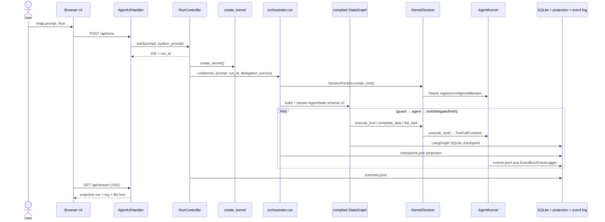
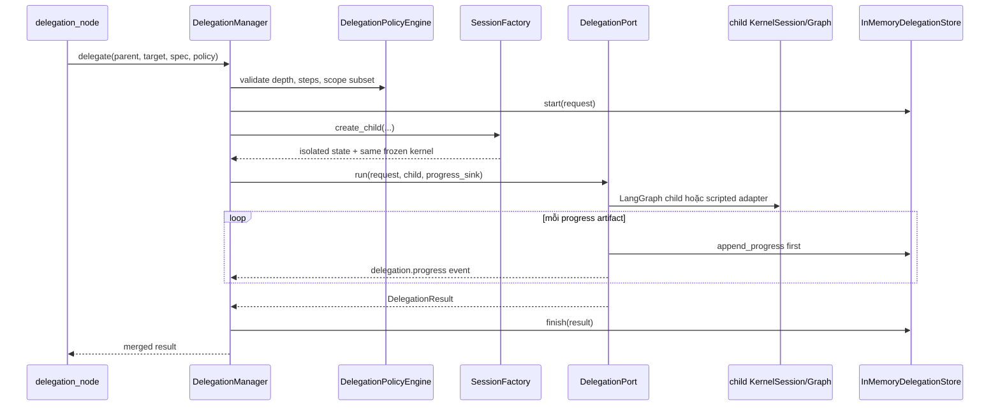

# RUNTIME FLOW — code đang chạy từ input đến output

> Snapshot được đối chiếu trực tiếp với source ngày **2026-06-25**. Đây là mô tả
> implementation hiện tại, không phải PRD tương lai. Full suite tại snapshot này:
> Full suite xanh (optional Qdrant integration được skip khi service không chạy); Ruff sạch;
> `run_smoke.py` thành công.
>
> Xem thêm: `RUN_AND_CONFIGURE.md` (cách chạy/cấu hình), `CLASS_ENCYCLOPEDIA.md` (toàn bộ
> class), `CODE_REVIEW.md` (finding và rủi ro), `class_dependency.mermaid` (phụ thuộc package).

## 1. Có hai runtime, nhưng chỉ một runtime được UI gọi mặc định

| Runtime | Entrypoint | Trạng thái |
|---|---|---|
| Single-agent LangGraph | `orchestrator.run()` / `resume()` | **Đường chạy mặc định** của UI; có SQLite checkpoint/resume |
| Supervisor TaskLoop | `supervisor.run_task_loop()` / `resume_task_loop()` | Thư viện E10 có optional SQLite Blackboard checkpoint/resume, nhưng **chưa được UI/bootstrap gọi** |

`skills/`, `roles/` và `rag/` là subsystem dùng được độc lập. Trong `config/features.yaml`
mặc định chỉ bật `example_echo`, `llm_chat`, `toolbox`; RAG chưa bật, role/skill registry chưa
được composition root dựng, Supervisor chưa được nối vào UI.

## 2. Đường chạy mặc định từ UI



Chi tiết:

1. `AgentUIHandler.do_POST()` kiểm tra kích thước JSON, prompt và system prompt.
2. `RunController.start()` sinh `run_id`, lưu `RunJob`, rồi chạy `_execute()` trong
   `ThreadPoolExecutor` (mặc định tối đa hai run song song).
3. `_execute()` tạo `EventLogger`, `AgentKernel`, gắn logger vào `EventBus`, và tạo
   `DelegationManager` nếu `config.delegation.enabled=true`.
4. `orchestrator.run()` tạo root `KernelSession`. Lần tạo session đầu tiên gọi
   `kernel.freeze()`: registry, middleware pipeline và config dùng chung không còn được sửa.
5. `new_agent_state()` tạo state schema v2 chỉ gồm dữ liệu checkpoint được; service/runtime
   object được capture trong closure khi compile graph.
6. `_stream()` chạy graph, ghi projection JSON sau mỗi state transition và trả outcome cuối.
7. `RunController` ghi `summary.json`; browser theo dõi bằng SSE.

## 3. Composition root và capability mặc định

```text
create_kernel
  -> load_config(config/features.yaml)
  -> build_kernel
       -> CapabilityRegistry
       -> EventBus
       -> AgentKernel
       -> features.loader.install_configured_features
            -> example_echo: echo
            -> llm_chat:    llm.chat
            -> toolbox:     fs_read, fs_write, fs_list, terminal_run
            -> rag:         rag_health, rag_ingest, rag_search (memory mặc định)
       -> _install_middleware(config)    # config mặc định hiện không khai báo middleware
```

Delegation không phải capability trong registry. `create_delegation_service()` dựng riêng:

```text
DelegationManager
  ├─ DelegationRegistry
  │    └─ LangGraphDelegationAgent("agent:general")
  ├─ SessionFactory(shared kernel)
  ├─ InMemoryDelegationStore
  └─ DelegationPolicyEngine
```

## 4. Topology single-agent LangGraph

Nguồn sự thật: `graph.runtime.build_agent_graph()`.

```text
START -> guard
guard    -> agent | fail
agent    -> tool | delegate | finish | guard | fail
tool     -> guard | fail
delegate -> guard | fail
finish   -> guard | END
fail     -> END
```

### `guard`

- Restore `session.state` từ snapshot trong `AgentState`.
- Nếu `budget.steps >= max_steps`: emit `graph.budget_blocked`, route `fail`.
- Nếu còn budget: route `agent`.

### `agent`

- Gọi `session.execute_tool("llm.chat", ...)`; LLM vì vậy đi qua cùng tool chokepoint.
- Nối raw assistant content vào `messages`.
- `parse_action()` sửa một số JSON hỏng nhẹ rồi yêu cầu field `action`.
- Parse lỗi tăng `parse_errors` nhưng không tăng `steps`; chưa quá ngưỡng thì thêm retry
  message và quay `guard`.
- Action hợp lệ tăng `steps` rồi route:
  - `tool` → `tool`;
  - `delegate` → `delegate`;
  - `final` → `finish`;
  - verb lạ → thêm hướng dẫn rồi quay `guard`.

### `tool`

- Tạo key ổn định từ `(tool_name, args)` và tăng bộ đếm same-tool.
- Quá `max_same_tool_calls` thì fail **trước** lần thực thi thừa.
- Gọi `session.execute_tool(name, args)` và nối toàn bộ `CapabilityResult` envelope vào
  transcript dưới role `user`, sau đó quay `guard`.

### `delegate`

- Validate shape `target/spec/policy` ở node.
- Gọi `DelegationServicePort.delegate()`; đây là chokepoint riêng, không phải kernel tool.
- Kết quả structured được nối vào transcript với prefix `DELEGATION_RESULT`, rồi parent quay
  lại `guard` dù child success/failed/rejected. Chỉ exception ở application boundary làm node fail.

### `finish` và `fail`

- `finish` gọi `check_finish(session.state, finish_reason)`. Nếu code đã đổi nhưng chưa có
  validation và không khai báo blocker, graph thêm lý do rồi quay `guard`.
- Khi gate cho phép, `session.complete_task()` đóng lifecycle đúng một lần.
- `fail` gọi `session.fail_task()` với reason và counters rồi đi thẳng `END`.

## 5. Tool chokepoint

Mọi call từ runtime chuẩn đi theo:

```text
KernelSession.execute_tool
  -> tạo ToolCallContext(identity + allowed_capabilities)
  -> AgentKernel.execute_tool
       1. ToolRequest(name, args, context, request_id)
       2. publish tool.requested (kèm raw args)
       3. scope check
       4. middleware ngoài -> trong
       5. CapabilityRegistry.resolve_tool
       6. executor.execute(request)
       7. CapabilityResult.from_raw(...).as_dict()
       8. publish tool.completed | tool.failed
```

Envelope cuối luôn có:

```json
{
  "ok": true,
  "capability": "echo",
  "feature": "example_echo",
  "data": {},
  "error": null,
  "metadata": {
    "run_id": "...",
    "task_id": "...",
    "session_id": "...",
    "parent_session_id": null,
    "delegation_id": null,
    "actor_id": "agent:root",
    "request_id": "..."
  }
}
```

`AgentKernel.execute_tool()` vẫn cho phép `context=None` vì compatibility tests và code cũ;
khi đó lineage là `None` và session scope không được áp. Runtime mới phải gọi qua `KernelSession`.

Middleware được đăng ký theo thứ tự outer → inner. Bootstrap hỗ trợ `timing`, `policy`, `retry`,
`condense`; `BudgetGuard` cố ý không được giữ trên shared kernel vì counter của nó phải per-run.
Toolbox còn có lớp `SafeToolPort -> ToolPolicy -> tool gốc`.

## 6. Delegation child flow



Child dùng cùng `AgentKernel` đã freeze nhưng có `SessionIdentity`, `StateStore` và capability scope
riêng. `LangGraphDelegationAgent` dùng `InMemorySaver`, chạy tuần tự và tắt recursive delegation.
Parent graph mới là state durable; delegation store và child checkpointer hiện chưa durable.

## 7. State và persistence

`AgentState` schema v2 chứa:

- identity: `run_id`, `task_id`, `session_identity`, `allowed_capabilities`;
- input/transcript: `task`, `context`, `messages`, `model`;
- discipline: serialized `Budget`;
- control: `last_action`, `route`, `status`, `error`, `final`, `outcome`;
- delegation projection: `active_delegation_id`, `last_delegation_result`;
- `session_state`: snapshot của `StateStore`, encode riêng `TaskEnvelope`.

Không được đặt client, connection, lock, kernel hoặc arbitrary dataclass vào graph state. Codec hiện
chỉ đặc cách `TaskEnvelope`; thêm kiểu mới vào `session.state` phải mở rộng codec và test resume.

| Artifact | Vai trò |
|---|---|
| `langgraph.sqlite` | Nguồn sự thật để resume parent graph |
| `taskloop.sqlite` | Nguồn sự thật optional của Supervisor Blackboard |
| `checkpoint.json` | Projection cho UI; không phải nguồn resume, trừ migrate legacy |
| `events.jsonl` | Event append-only của run |
| `summary.json` | Status, metrics và outcome cuối |
| `index.jsonl` | Index tối giản các run đã finish |

## 8. Resume

```text
resume(kernel, run_id)
  ├─ chưa có langgraph.sqlite
  │    └─ load legacy checkpoint.json
  │         ├─ terminal -> trả last_result
  │         └─ running  -> migrate thành AgentState v2 -> stream trên graph mới
  └─ đã có langgraph.sqlite
       -> đọc raw channel_values
       -> restore SessionIdentity + session_state + allowed_capabilities
       -> compile graph với session mới
       -> terminal hoặc không còn next node: trả outcome
       -> running và còn next node: graph.stream(None, same thread_id)
```

Invariant: `run_id == LangGraph thread_id`. `checkpoint.json` không được sửa để điều khiển resume.

## 9. Observability và UI read model

- `EventBus` copy sâu payload cho từng subscriber; observer lỗi không làm sập runtime.
- `EventLogger` khóa sequence/write trong process, phân loại LLM event riêng và đếm metrics.
- `RunController` giữ state job chỉ trong memory; run artifact nằm trên disk.
- `AgentUIHandler` phục vụ bootstrap/snapshot/tree/file/run/SSE endpoints.
- SSE hiện dựng lại toàn bộ run snapshot và project/workspace tree khi có client; đây là local
  console, không phải telemetry backend cho tải lớn.

## 10. Supervisor TaskLoop (đường chạy thay thế)

`supervisor.run_task_loop()` là plain-Python round loop:

```text
compose_team
  -> while chưa terminal:
       o_decide (JSON gate + parse-error budget)
       ├─ continue  -> Broker ContextPacket -> DelegationManager -> worker turns
       ├─ need_tool -> supervisor_session.execute_tool
       ├─ finished  -> acceptance evidence gate
       ├─ blocked   -> terminal blocked
       └─ failed    -> terminal failed
       -> guard max_rounds / no-progress / repeated-decision
```

Blackboard là `TaskLoopState`, encode được thành primitives. Khi caller truyền
`SqliteTaskLoopStore`, loop save sau compose, từng completed worker turn, round boundary và terminal.
`resume_task_loop()` restore Blackboard rồi hỏi Agent O một decision mới; nếu decision mới giao lại
agent đã có turn trong cùng `round_no`, `run_round()` bỏ qua agent đó. Current decision/pending list,
Budget và repeated-decision history chưa nằm trong checkpoint. Agent O và LLMBroker có thể dùng
`KernelChatLLM`, nên model calls vẫn qua `llm.chat`. Worker turns đi qua `DelegationManager`.

Giới hạn hiện tại: TaskLoop vẫn là plain-Python driver (không phải compiled LangGraph), SQLite là
opt-in và chưa được UI gọi; in-flight child delegation vẫn chưa có durable idempotency ledger;
role allowlist/route permission chưa được nối thành enforcement. Xem `CODE_REVIEW.md`.

## 11. Feature activation matrix

| Subsystem | Có implementation | Bật mặc định | Đi vào UI runtime |
|---|---:|---:|---:|
| Kernel/session/toolbox/LLM | Có | Có | Có |
| Parent LangGraph checkpoint/resume | Có | Có | Có |
| Delegation `agent:general` | Có | Có | Có |
| RAG memory backend | Có | Có | Có |
| RAG Qdrant backend | Có; optional extras + local service | Không | Khi đổi `rag.backend=qdrant` |
| Skills parser/registry | Có | Không cần feature config | Chưa compose |
| Roles/lenses/AgentRegistry | Có | Không cần feature config | Chưa compose/enforce |
| Supervisor TaskLoop | Có; optional SQLite Blackboard resume | Không | Không |

## 12. Invariant khi sửa runtime

1. Runtime mới gọi tool qua `KernelSession.execute_tool`, không gọi thẳng executor.
2. Delegation đi qua `DelegationServicePort`, không thêm method delegation vào kernel.
3. Kernel/config/registry dùng chung phải freeze trước khi chạy session song song.
4. Child scope phải là tập con của parent scope.
5. Graph state và session snapshot phải checkpoint được.
6. Mọi nhánh terminal single-agent phải đóng lifecycle đúng một lần.
7. SQLite là nguồn resume; JSON chỉ là read model.
8. Đổi topology/state schema phải cập nhật tài liệu này và test resume.

## 13. Kiểm chứng

```bash
python run_smoke.py
python -m pytest
python -m ruff check .
python -m observability.inspect summary latest
python -m observability.inspect events latest
```
