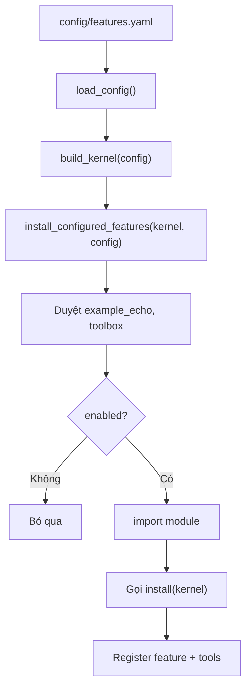

# Giải thích `config/features.yaml`

File `config/features.yaml` là config mặc định để bootstrap biết feature nào được bật và module Python nào cần import.

Nói ngắn gọn: `features.yaml` quyết định runtime có những plugin/capability nào.

## Nội dung hiện tại

```yaml
features:
  example_echo:
    enabled: true
    module: features.example_echo
  toolbox:
    enabled: true
    module: toolbox.feature
```

## Vai trò trong architecture

Luồng dùng config:

```text
core.bootstrap.load_config()
  -> đọc config/features.yaml
  -> core.bootstrap.build_kernel(config)
  -> features.loader.install_configured_features(kernel, config)
  -> import module feature được bật
  -> gọi install(kernel)
  -> feature đăng ký tool vào kernel.registry
```

Kernel không tự biết feature nào tồn tại. Config này là danh sách feature được phép nạp.

## Key `features`

```yaml
features:
```

Root key `features` là mapping chứa các feature có thể được nạp.

`core.bootstrap.load_config()` đảm bảo config luôn có key `features`; nếu file thiếu, nó tự set `features: {}`.

## Feature `example_echo`

```yaml
example_echo:
```

Đây là tên feature trong config.

Tên này chủ yếu giúp người đọc và loader biết đang xử lý feature nào. Feature module thật cũng khai báo `FeatureDescriptor(name="example_echo")`.

## Field `enabled`

```yaml
enabled: true
```

Cho biết feature có được nạp không.

Trong `features.loader`:

```python
if not spec.get("enabled", False):
    continue
```

Nghĩa là:

- `enabled: true` -> nạp feature,
- `enabled: false` -> bỏ qua,
- thiếu `enabled` -> mặc định bỏ qua.

Thiết kế này yêu cầu feature phải được bật rõ ràng.

## Field `module`

```yaml
module: features.example_echo
```

Đường dẫn module Python sẽ được import bằng:

```python
importlib.import_module(module_path)
```

Với giá trị hiện tại, loader import:

```python
features.example_echo
```

Module đó phải có function:

```python
def install(kernel):
    ...
```

Nếu feature enabled nhưng thiếu `module`, loader sẽ raise `ValueError`.

Nếu module không có `install`, loader cũng raise `ValueError`.

## Feature `toolbox`

```yaml
toolbox:
  enabled: true
  module: toolbox.feature
```

`toolbox` là feature cung cấp các tool thao tác workspace:

- `fs_read`
- `fs_write`
- `fs_list`
- `terminal_run`

Module `toolbox.feature` đăng ký các tool này vào registry và bọc từng tool bằng `SafeToolPort`, tức mọi call đi qua safety policy trước khi tool thật chạy.

Ý nghĩa: khi `toolbox` bật, agent graph có thể đọc/ghi/list file trong workspace và chạy terminal argv an toàn.

## Luồng nạp feature từ YAML



## Cách thêm feature mới

Ví dụ muốn thêm feature `filesystem`:

```yaml
features:
  example_echo:
    enabled: true
    module: features.example_echo
  filesystem:
    enabled: true
    module: features.filesystem
```

Module `features/filesystem.py` cần có:

```python
def install(kernel):
    kernel.registry.register_feature(FEATURE)
    kernel.registry.register_tools(FEATURE.capabilities, FileTool(), feature_name=FEATURE.name)
```

## Ý nghĩa thiết kế

### 1. Runtime cấu hình được

Cùng một codebase có thể bật/tắt feature bằng YAML.

### 2. Kernel không cần sửa khi thêm feature

Chỉ cần thêm module feature và update config.

### 3. Fail sớm với config sai

Feature enabled nhưng thiếu module/install sẽ lỗi ngay lúc bootstrap.

## Quan hệ với file khác

- `core/bootstrap.py`: đọc file này qua `load_config()`.
- `features/loader.py`: đọc `config["features"]` và import module.
- `features/example_echo.py`: module echo hiện đang được bật.
- `toolbox/feature.py`: module toolbox hiện đang được bật.
- `tests/test_kernel.py`: `test_default_config_loads()` xác nhận config mặc định nạp `echo`.
- `tests/test_graph.py`: bật `toolbox` trong config test để agent dùng filesystem tools.

## Tóm tắt một câu

`config/features.yaml` là danh sách feature được bật cho runtime; hiện nó bật `example_echo` cho capability `echo` và `toolbox` cho filesystem/terminal tools có safety gate.
