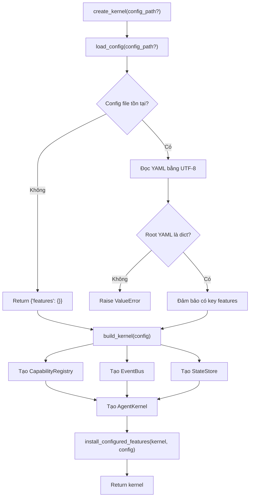

# Giải thích `core/bootstrap.py`

File `core/bootstrap.py` chịu trách nhiệm khởi tạo runtime của agent. Nếu `core/kernel.py` là lõi điều phối, thì `core/bootstrap.py` là nơi lắp ráp lõi đó: đọc config, tạo các dependency cần thiết, cài feature/plugin, rồi trả về một `AgentKernel` đã sẵn sàng chạy.

Nói ngắn gọn: `bootstrap.py` là điểm dựng hệ thống.

## Vai trò trong architecture

`bootstrap.py` nằm ở ranh giới giữa cấu hình bên ngoài và kernel bên trong.

Nó làm các việc:

- xác định thư mục project,
- tìm file config mặc định,
- đọc YAML config,
- tạo `CapabilityRegistry`,
- tạo `EventBus`,
- tạo `StateStore`,
- tạo `AgentKernel`,
- nạp các feature được bật trong config.

Điểm quan trọng: kernel không tự đọc file config và không tự import feature. Việc đó được tách ra ở bootstrap để giữ kernel nhỏ, sạch và dễ test.

## Các import

```python
from __future__ import annotations
```

Bật postponed evaluation cho type annotations. Điều này giúp annotation nhẹ hơn ở runtime và giảm rủi ro khi có type liên quan tới import vòng.

```python
from pathlib import Path
from typing import Any
```

- `Path`: xử lý đường dẫn file/thư mục theo cách rõ ràng, cross-platform.
- `Any`: dùng cho config vì YAML có thể chứa nhiều kiểu dữ liệu khác nhau.

```python
import yaml
```

Dùng thư viện PyYAML để đọc `features.yaml`.

```python
from core.events import EventBus
from core.kernel import AgentKernel
from core.registry import CapabilityRegistry
from core.state import StateStore
```

Đây là các thành phần cần lắp vào kernel:

- `EventBus`: kênh publish/subscribe event.
- `AgentKernel`: lõi runtime.
- `CapabilityRegistry`: nơi đăng ký và resolve tool/capability.
- `StateStore`: state store đơn giản.

## Hằng số đường dẫn

```python
PROJECT_DIR = Path(__file__).resolve().parent.parent
DEFAULT_CONFIG_PATH = PROJECT_DIR / "config" / "features.yaml"
```

`PROJECT_DIR` lấy thư mục gốc project dựa trên vị trí của file `bootstrap.py`.

Vì file nằm ở:

```text
core/bootstrap.py
```

nên:

```python
Path(__file__).resolve().parent
```

là thư mục `core/`, còn `.parent.parent` là thư mục gốc project.

`DEFAULT_CONFIG_PATH` trỏ tới:

```text
config/features.yaml
```

Ý nghĩa: nếu caller không truyền config riêng, hệ thống sẽ dùng config mặc định này.

## Function `load_config`

```python
def load_config(config_path: str | Path | None = None) -> dict[str, Any]:
```

Function này đọc config feature từ file YAML và trả về dict.

Input:

- `config_path`: đường dẫn config tùy chọn.
- Nếu không truyền, dùng `DEFAULT_CONFIG_PATH`.

### Chọn đường dẫn config

```python
path = Path(config_path) if config_path else DEFAULT_CONFIG_PATH
```

Nếu caller truyền `config_path`, convert nó thành `Path`. Nếu không, dùng file mặc định.

### Nếu file không tồn tại

```python
if not path.exists():
    return {"features": {}}
```

Nếu config không tồn tại, function không crash. Nó trả về config rỗng với key `features`.

Ý nghĩa: kernel vẫn có thể được tạo ngay cả khi không có feature nào được cấu hình.

### Đọc YAML

```python
data = yaml.safe_load(path.read_text(encoding="utf-8")) or {}
```

File được đọc bằng UTF-8. `yaml.safe_load()` parse YAML thành Python object.

Nếu file rỗng hoặc parse ra `None`, dùng `{}` thay thế.

### Kiểm tra root object phải là mapping

```python
if not isinstance(data, dict):
    raise ValueError(f"Feature config must be a mapping: {path}")
```

Config hợp lệ phải là dict/mapping. Ví dụ hợp lệ:

```yaml
features:
  example_echo:
    enabled: true
    module: features.example_echo
```

Ví dụ không hợp lệ:

```yaml
- item1
- item2
```

Nếu root YAML là list/string/number, function raise `ValueError`.

### Đảm bảo luôn có key `features`

```python
data.setdefault("features", {})
```

Dù file YAML không có key `features`, output vẫn có `features: {}`.

Điều này giúp code phía sau không phải check thiếu key nhiều lần.

### Trả config

```python
return data
```

Kết quả là dict config dùng để build kernel.

## Function `build_kernel`

```python
def build_kernel(config: dict[str, Any]) -> AgentKernel:
```

Function này nhận config đã parse và tạo một `AgentKernel`.

Khác với `create_kernel()`, function này không đọc file. Nó chỉ build từ dict có sẵn. Điều này rất hữu ích cho test vì test có thể truyền config trực tiếp.

### Tạo kernel và dependency

```python
kernel = AgentKernel(
    registry=CapabilityRegistry(),
    events=EventBus(),
    state=StateStore(),
    config=config,
)
```

Ở đây bootstrap tạo toàn bộ dependency cần thiết:

- registry mới,
- event bus mới,
- state store mới,
- config hiện tại.

Sau đó inject chúng vào `AgentKernel`.

Ý nghĩa thiết kế: kernel nhận dependency từ bên ngoài thay vì tự tạo dependency bên trong. Cách này giúp dễ test, dễ thay thế implementation, và giữ kernel không bị dính vào bootstrap logic.

### Import feature loader bên trong function

```python
from features.loader import install_configured_features
```

Import này được đặt bên trong `build_kernel()` thay vì ở top-level.

Ý nghĩa có thể có:

- giảm coupling khi chỉ import module `core.bootstrap`,
- tránh import feature layer quá sớm,
- giảm rủi ro import vòng giữa core và features.

Đây là một lựa chọn hợp lý trong kiến trúc plugin.

### Cài feature theo config

```python
install_configured_features(kernel, config)
```

Feature loader sẽ đọc `config["features"]`, import module feature được bật, rồi gọi `install(kernel)` của từng feature.

Sau bước này, registry trong kernel đã có các tool/capability được config bật.

### Trả kernel

```python
return kernel
```

Kernel trả về ở đây là kernel đã được lắp registry, events, state, config, và feature.

## Function `create_kernel`

```python
def create_kernel(config_path: str | Path | None = None) -> AgentKernel:
    return build_kernel(load_config(config_path))
```

Đây là helper cấp cao nhất trong file.

Nó làm hai việc:

1. `load_config(config_path)`: đọc config từ file.
2. `build_kernel(...)`: tạo kernel từ config đó.

Đây là entrypoint tiện lợi cho runner hoặc app code.

Ví dụ trong `run_smoke.py`:

```python
kernel = create_kernel()
```

Lệnh này tự dùng `config/features.yaml`, build kernel, cài feature, rồi trả về kernel sẵn sàng gọi tool.

## Luồng bootstrap tổng quát



## Vì sao bootstrap được tách khỏi kernel?

### 1. Kernel không phải biết file system

Kernel không đọc `features.yaml`, không biết path project, không biết YAML. Điều này giữ kernel thuần hơn và dễ test hơn.

### 2. Config là trách nhiệm của composition layer

`bootstrap.py` là nơi composition: ghép các object lại với nhau. Đây là chỗ phù hợp để đọc config và quyết định feature nào được nạp.

### 3. Test dễ hơn

Test có thể gọi:

```python
build_kernel({"features": {...}})
```

mà không cần tạo file YAML thật.

### 4. Feature/plugin không làm lõi phình ra

Feature được nạp qua `features.loader`. Kernel chỉ thấy registry sau khi feature đã đăng ký tool. Cách này giữ lõi ổn định khi số lượng feature tăng.

## Quan hệ với file khác

- `core/kernel.py`: class `AgentKernel` được tạo ở đây.
- `core/registry.py`: cung cấp `CapabilityRegistry`.
- `core/events.py`: cung cấp `EventBus`.
- `core/state.py`: cung cấp `StateStore`.
- `features/loader.py`: cài feature từ config.
- `config/features.yaml`: config mặc định.

## Tóm tắt một câu

`core/bootstrap.py` là composition layer của project: đọc config, tạo dependency, lắp `AgentKernel`, nạp feature, và trả về runtime sẵn sàng sử dụng.
