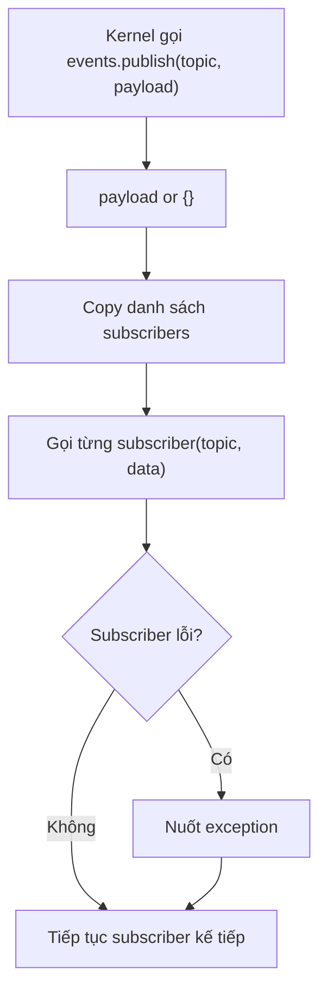

# Giải thích `core/events.py`

File `core/events.py` định nghĩa một event bus tối giản cho runtime. Event bus cho phép kernel phát sự kiện, còn các thành phần khác như observability subscribe để ghi log hoặc tính metrics.

Nói ngắn gọn: `events.py` là hệ thống pub/sub nhỏ bên trong agent.

## Vai trò trong architecture

Kernel cần thông báo các sự kiện như:

- task đã được nhận,
- tool được yêu cầu,
- tool chạy xong,
- tool thất bại.

Nhưng kernel không nên biết log được ghi ra file nào, format gì, metrics tính ra sao. Vì vậy kernel chỉ publish event qua `EventBus`.

`observability/event_log.py` có thể subscribe vào bus để ghi `events.jsonl`. Sau này UI, telemetry hoặc debugger cũng có thể subscribe mà không cần sửa kernel.

## Các import

```python
from __future__ import annotations
```

Bật postponed evaluation cho annotation.

```python
from typing import Any, Callable
```

- `Any`: dùng cho payload event linh hoạt.
- `Callable`: mô tả kiểu subscriber function.

## Type alias `Subscriber`

```python
Subscriber = Callable[[str, dict[str, Any]], None]
```

`Subscriber` là một function nhận:

1. `topic`: tên event, kiểu `str`.
2. `payload`: dữ liệu event, kiểu `dict[str, Any]`.

và không trả về gì.

Ví dụ subscriber:

```python
def sink(topic: str, payload: dict[str, Any]) -> None:
    print(topic, payload)
```

Ý nghĩa: event bus không cần biết subscriber là logger, metric collector hay test hook. Chỉ cần subscriber có đúng signature.

## Class `EventBus`

```python
class EventBus:
    """Minimal pub/sub. Observability subscribes here (E04)."""
```

`EventBus` là implementation pub/sub rất nhỏ.

Nó có:

- danh sách subscriber,
- method để subscribe,
- method để publish event.

Docstring nói rõ observability sẽ subscribe ở đây.

## Constructor `__init__`

```python
def __init__(self) -> None:
    self._subscribers: list[Subscriber] = []
```

Khi tạo event bus, danh sách subscriber ban đầu rỗng.

`_subscribers` là list các function có kiểu `Subscriber`.

Prefix `_` cho thấy đây là internal state.

## Method `subscribe`

```python
def subscribe(self, fn: Subscriber) -> None:
    self._subscribers.append(fn)
```

Đăng ký một subscriber.

Input:

- `fn`: function nhận `(topic, payload)`.

Sau khi subscribe, mỗi lần bus publish event, function này sẽ được gọi.

Ví dụ:

```python
bus.subscribe(lambda topic, payload: print(topic, payload))
```

Trong observability:

```python
bus.subscribe(sink)
```

## Method `publish`

```python
def publish(self, topic: str, payload: dict[str, Any] | None = None) -> None:
```

Phát một event tới tất cả subscriber.

Input:

- `topic`: tên event.
- `payload`: dữ liệu event, optional.

### Chuẩn hóa payload

```python
data = payload or {}
```

Nếu caller không truyền payload hoặc truyền `None`, event bus dùng dict rỗng.

### Duyệt subscriber

```python
for fn in list(self._subscribers):
```

Bus lặp qua bản copy của `_subscribers`.

Việc dùng `list(...)` có ý nghĩa: nếu subscriber thêm/xóa subscriber trong lúc đang xử lý event, vòng lặp hiện tại ít bị ảnh hưởng hơn.

### Gọi subscriber

```python
try:
    fn(topic, data)
except Exception:
    # An observer must never break the runtime.
    pass
```

Mỗi subscriber được gọi với `topic` và `data`.

Nếu subscriber lỗi, exception bị nuốt.

Comment trong code rất quan trọng:

```python
# An observer must never break the runtime.
```

Ý nghĩa: observer/logger/debugger không được làm sập agent runtime. Kernel là luồng chính; observability là phụ trợ. Nếu logger lỗi, agent vẫn nên tiếp tục.

## Event topic hiện đang dùng

Trong `core/kernel.py`, kernel publish:

```python
"task.accepted"
"tool.requested"
"tool.completed"
"tool.failed"
```

Các topic này không được define thành enum trong `events.py`; hiện tại chúng là string convention.

## Luồng publish event



## Vì sao EventBus được thiết kế tối giản?

### 1. Đủ dùng cho Sprint 0

Project đang ở nền móng. Event bus chỉ cần subscribe/publish để observability hoạt động.

### 2. Không kéo dependency ngoài

Không cần message queue, async framework hay event library phức tạp.

### 3. Dễ test

Test có thể subscribe lambda đơn giản:

```python
seen = []
bus.subscribe(lambda topic, payload: seen.append(topic))
```

### 4. Runtime an toàn hơn

Subscriber lỗi không phá runtime. Đây là nguyên tắc tốt cho logging/observability.

## Giới hạn hiện tại

Event bus hiện tại:

- chạy đồng bộ,
- không có unsubscribe,
- không có topic filtering,
- không có backpressure,
- không log lỗi subscriber,
- không thread-safe rõ ràng.

Những giới hạn này chấp nhận được cho lõi ban đầu. Nếu runtime lớn hơn, có thể mở rộng sau.

## Quan hệ với file khác

- `core/kernel.py`: publish event vào bus.
- `core/bootstrap.py`: tạo `EventBus` rồi inject vào `AgentKernel`.
- `observability/event_log.py`: subscribe vào bus để ghi event log.
- `tests/test_kernel.py`: subscribe để kiểm tra event được emit.

## Tóm tắt một câu

`core/events.py` cung cấp event bus pub/sub tối giản để kernel phát sự kiện mà không phụ thuộc trực tiếp vào logging, metrics hay observability.
