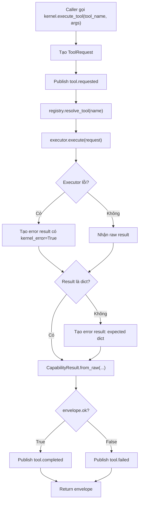

# Giải thích `core/kernel.py`

File `core/kernel.py` định nghĩa `AgentKernel`, tức lõi runtime tối thiểu của agent. Đây là nơi gom lại các thành phần nền tảng như registry, event bus, state store và config để nhận task, gọi tool/capability, chuẩn hóa kết quả, rồi phát event cho observability hoặc các subscriber khác.

Nói ngắn gọn: kernel không chứa hành vi nghiệp vụ cụ thể. Kernel chỉ điều phối. Tool thật sự làm gì sẽ nằm ở các feature/plugin được đăng ký vào `CapabilityRegistry`.

## Vai trò của kernel trong architecture

Project này đi theo hướng hexagonal architecture, hay còn gọi là ports and adapters.

Trong cách thiết kế này:

- `AgentKernel` là lõi điều phối.
- `CapabilityRegistry` là nơi tra cứu capability/tool đã đăng ký.
- Tool executor là adapter bên ngoài, chạy sau một port chung.
- `EventBus` là kênh phát sự kiện runtime.
- `StateStore` là nơi giữ state đơn giản của phiên chạy.
- `CapabilityResult` là envelope chuẩn hóa kết quả trả về.

Điểm quan trọng là kernel không import trực tiếp các tool như `echo`, browser, filesystem hay LLM. Kernel chỉ biết registry có thể resolve một tool theo tên. Nhờ vậy có thể thêm/bớt feature bằng config mà không phải sửa kernel.

## Toàn bộ nội dung file

```python
from __future__ import annotations
```

Dòng này bật cơ chế postponed evaluation cho type annotations. Nhờ đó annotation kiểu `dict[str, Any] | None` hoặc tên class có thể được xử lý mềm hơn ở runtime, giảm rủi ro lỗi import vòng và làm type hint nhẹ hơn.

```python
from dataclasses import dataclass, field
from typing import Any
```

Kernel dùng `@dataclass` để khai báo class chứa dependency một cách gọn.

- `dataclass`: tự sinh `__init__`, repr và một số method cơ bản.
- `field`: dùng để khai báo default factory cho field mutable.
- `Any`: type hint cho dữ liệu chưa cố định schema, ví dụ config hoặc args.

```python
from core.events import EventBus
from core.registry import CapabilityRegistry
from core.schemas import CapabilityResult, TaskEnvelope, ToolRequest
from core.state import StateStore
```

Đây là các dependency nội bộ của kernel:

- `EventBus`: phát sự kiện như `task.accepted`, `tool.requested`, `tool.completed`, `tool.failed`.
- `CapabilityRegistry`: lưu và resolve các tool/capability.
- `CapabilityResult`: chuẩn hóa kết quả tool.
- `TaskEnvelope`: bọc thông tin task người dùng đưa vào.
- `ToolRequest`: bọc request gọi tool.
- `StateStore`: lưu state runtime, hiện tại chủ yếu lưu `current_task`.

## Class `AgentKernel`

```python
@dataclass
class AgentKernel:
```

`AgentKernel` là object trung tâm của runtime. Nó được tạo trong `core/bootstrap.py`, thông qua `build_kernel()` hoặc `create_kernel()`.

Docstring trong file:

```python
"""
Minimal living core. Owns state, events, capability lookup.
Concrete behavior lives behind ports/adapters in the registry.
"""
```

Ý nghĩa:

- `Minimal living core`: lõi nhỏ nhất nhưng chạy được.
- `Owns state, events, capability lookup`: kernel sở hữu state, event bus và khả năng tìm tool.
- `Concrete behavior lives behind ports/adapters`: hành vi cụ thể không nằm trong kernel, mà nằm sau registry dưới dạng executor/adapter.

## Các field của `AgentKernel`

```python
registry: CapabilityRegistry
events: EventBus
state: StateStore
config: dict[str, Any] = field(default_factory=dict)
```

### `registry`

`registry` là bảng đăng ký capability. Khi kernel cần chạy tool tên `"echo"`, nó gọi:

```python
self.registry.resolve_tool(request.name)
```

Registry trả về executor tương ứng nếu tool tồn tại. Nếu không tồn tại, registry trả về null fallback để kernel vẫn sống và trả lỗi có cấu trúc.

### `events`

`events` là event bus nội bộ. Kernel không tự ghi log ra file. Thay vào đó, kernel publish event. Thành phần khác như `EventLogger` có thể subscribe vào bus để ghi JSONL hoặc tính metrics.

Điểm hay là observability không làm kernel phụ thuộc vào logging cụ thể.

### `state`

`state` là kho state đơn giản. Trong file này kernel dùng state để lưu task hiện tại:

```python
self.state.set("current_task", task)
```

Sau này state có thể được mở rộng để giữ thông tin vòng lặp agent, validation status, history, hoặc context.

### `config`

`config` là dict cấu hình runtime. Trong kernel hiện tại, field này chưa được dùng trực tiếp nhiều. Nó được giữ để kernel biết cấu hình đã dùng khi bootstrap, và để các phần mở rộng sau này có thể đọc thông tin cần thiết.

`field(default_factory=dict)` được dùng thay vì `config: dict = {}` để tránh dùng chung một mutable dict giữa nhiều instance.

## Method `accept_task`

```python
def accept_task(self, user_request: str, context: dict[str, Any] | None = None) -> TaskEnvelope:
```

Method này nhận yêu cầu của user và biến nó thành `TaskEnvelope`.

Input:

- `user_request`: nội dung task gốc từ người dùng.
- `context`: context bổ sung nếu có. Nếu không truyền thì dùng dict rỗng.

Luồng chạy:

```python
task = TaskEnvelope(user_request=user_request, context=context or {})
```

Tạo envelope cho task. `TaskEnvelope` tự sinh `task_id`, nên mỗi task có định danh riêng.

```python
self.state.set("current_task", task)
```

Lưu task hiện tại vào state dưới key `"current_task"`.

```python
self.events.publish("task.accepted", {"task_id": task.task_id})
```

Phát event để hệ thống bên ngoài biết kernel đã nhận task. Event này có thể được logger ghi lại.

```python
return task
```

Trả lại `TaskEnvelope` cho caller.

Ý nghĩa thiết kế: `accept_task()` là cổng vào chính thức của một task. Nó không chạy LLM, không gọi tool, không xử lý toàn bộ agent loop. Nó chỉ chuẩn hóa việc nhận task, lưu state và phát event.

## Method `execute_tool`

```python
def execute_tool(self, tool_name: str, args: dict[str, Any] | None = None) -> dict[str, Any]:
```

Đây là method quan trọng nhất của kernel hiện tại. Nó chạy một tool theo tên và args, sau đó luôn trả về một dict theo envelope chuẩn.

Input:

- `tool_name`: tên capability/tool cần gọi, ví dụ `"echo"`.
- `args`: tham số truyền cho tool. Nếu không có thì dùng dict rỗng.

### Bước 1: tạo `ToolRequest`

```python
request = ToolRequest(name=tool_name, args=args or {})
```

Thay vì truyền raw string và raw args xuống executor, kernel bọc chúng vào `ToolRequest`. `ToolRequest` có `request_id` riêng để trace từng lần gọi tool.

### Bước 2: publish event `tool.requested`

```python
self.events.publish(
    "tool.requested",
    {"tool": request.name, "request_id": request.request_id, "args": request.args},
)
```

Kernel phát event trước khi chạy tool. Event này cho biết:

- tool nào được yêu cầu,
- request id là gì,
- args truyền vào là gì.

Nhờ event này, observability có thể ghi lại đầy đủ lịch sử gọi tool.

### Bước 3: resolve executor từ registry

```python
resolution = self.registry.resolve_tool(request.name)
```

Kernel hỏi registry: tool tên này sẽ do executor nào xử lý?

`resolution` gồm:

- `executor`: object có method `execute(request)`.
- `feature`: tên feature sở hữu tool đó, ví dụ `"example_echo"`.

Nếu tool không tồn tại, registry vẫn trả về `NullToolPort`. Đây là điểm rất quan trọng: missing tool không làm kernel crash.

### Bước 4: chạy executor và bắt lỗi

```python
try:
    result = resolution.executor.execute(request)
except Exception as exc:
    result = {"ok": False, "tool": request.name, "error": str(exc), "kernel_error": True}
```

Kernel gọi executor. Nếu executor ném exception, kernel bắt lại và biến lỗi thành result có cấu trúc.

Ý nghĩa: tool không được phép làm sập kernel. Trong agent runtime, đây là nguyên tắc sống còn, vì tool có thể lỗi vì input sai, file thiếu, network lỗi hoặc bug nội bộ.

`kernel_error: True` cho biết lỗi được kernel bắt lại trong quá trình execute.

### Bước 5: đảm bảo result là dict

```python
if not isinstance(result, dict):
    result = {
        "ok": False,
        "tool": request.name,
        "error": f"Tool returned {type(result).__name__}, expected dict.",
        "kernel_error": True,
    }
```

Kernel yêu cầu executor phải trả về dict. Nếu tool trả về string/list/object khác, kernel coi đó là lỗi và normalize lại.

Ý nghĩa: boundary giữa kernel và tool cần hợp đồng rõ ràng. Hợp đồng ở đây là tool executor phải trả dict.

### Bước 6: bọc kết quả bằng `CapabilityResult`

```python
envelope = CapabilityResult.from_raw(
    capability=request.name,
    feature=resolution.feature,
    result=result,
    metadata={
        "request_id": request.request_id,
        "executor": getattr(resolution.executor, "name", resolution.executor.__class__.__name__),
    },
).as_dict()
```

Đây là bước chuẩn hóa quan trọng nhất.

Dù tool trả về raw dict như:

```python
{"ok": True, "echo": {"msg": "hi"}}
```

Kernel sẽ chuyển thành envelope dạng chuẩn:

```python
{
    "ok": True,
    "capability": "echo",
    "feature": "example_echo",
    "data": {"echo": {"msg": "hi"}},
    "error": None,
    "metadata": {
        "request_id": "...",
        "executor": "echo_tool",
        "raw_keys": ["echo", "ok"]
    }
}
```

Ý nghĩa từng field:

- `ok`: tool thành công hay thất bại.
- `capability`: capability được gọi.
- `feature`: feature sở hữu capability.
- `data`: payload thành công hoặc thông tin phụ.
- `error`: message lỗi nếu có.
- `metadata`: thông tin trace như request id, executor name.

`getattr(resolution.executor, "name", resolution.executor.__class__.__name__)` nghĩa là:

- nếu executor có attribute `name`, dùng nó;
- nếu không, dùng tên class của executor.

Nhờ đó metadata luôn có tên executor để debug.

### Bước 7: publish event kết thúc

```python
self.events.publish(
    "tool.completed" if envelope.get("ok") else "tool.failed",
    {
        "tool": request.name,
        "request_id": request.request_id,
        "ok": bool(envelope.get("ok")),
        "error": envelope.get("error"),
    },
)
```

Nếu envelope có `ok=True`, kernel publish `tool.completed`. Nếu không, publish `tool.failed`.

Payload gồm:

- `tool`: tên tool,
- `request_id`: id của lần gọi,
- `ok`: trạng thái boolean,
- `error`: lỗi nếu có.

Observability dùng event này để tính metrics `tool_calls` và `tool_failures`.

### Bước 8: trả envelope

```python
return envelope
```

Caller luôn nhận về dict chuẩn. Đây là thứ agent loop hoặc test có thể dùng tiếp.

## Method `describe_capabilities`

```python
def describe_capabilities(self) -> dict[str, Any]:
    return {"features": self.registry.list_features(), "tools": self.registry.list_tools()}
```

Method này trả về danh sách feature và tool đã đăng ký.

Ví dụ khi `example_echo` bật:

```python
{
    "features": [
        {
            "name": "example_echo",
            "version": "0.1",
            "capabilities": ["echo"],
            "enabled": True,
            "description": "..."
        }
    ],
    "tools": [
        {
            "name": "echo",
            "feature": "example_echo"
        }
    ]
}
```

Ý nghĩa: đây là API introspection đơn giản để biết kernel hiện có thể làm gì.

## Luồng `execute_tool` tổng quát



## Vì sao kernel được thiết kế như vậy?

### 1. Kernel nhỏ và ổn định

Kernel chỉ làm điều phối. Nó không chứa business logic, không chứa prompt, không gọi OpenAI trực tiếp, không biết feature cụ thể. Điều này giúp lõi ít thay đổi khi thêm tool mới.

### 2. Tool lỗi không làm chết runtime

`execute_tool()` bắt exception và kiểm tra kiểu return. Đây là safety boundary giữa lõi và adapter bên ngoài.

### 3. Kết quả luôn đồng nhất

Mọi tool call đều được bọc bằng `CapabilityResult`. Điều này làm phần agent loop sau này dễ viết hơn, vì không phải xử lý mỗi tool một kiểu response.

### 4. Observability tách khỏi kernel

Kernel chỉ publish event. Logger subscribe qua `EventBus`. Nhờ vậy có thể bật/tắt logging, thay logger hoặc thêm metrics mà không sửa kernel.

### 5. Feature/plugin dễ mở rộng

Tool được đăng ký vào registry. Feature mới chỉ cần có `install(kernel)` rồi gọi `kernel.registry.register_tools(...)`. Kernel không cần biết module đó là gì.

## Quan hệ với các file khác

- `core/bootstrap.py`: tạo `AgentKernel`, đọc config, cài feature.
- `core/registry.py`: resolve tool executor cho kernel.
- `core/schemas.py`: định nghĩa envelope/request/result mà kernel dùng.
- `core/events.py`: cung cấp pub/sub cho kernel.
- `core/state.py`: cung cấp state store cho kernel.
- `features/loader.py`: nạp feature từ config.
- `features/example_echo.py`: ví dụ feature đăng ký tool `echo`.
- `observability/event_log.py`: subscribe vào event bus để ghi log.

## Trạng thái hiện tại của kernel

Kernel hiện tại là foundation, chưa phải một agent loop hoàn chỉnh.

Nó đã có:

- nhận task,
- lưu current task,
- gọi tool qua registry,
- fallback khi tool thiếu,
- bắt lỗi executor,
- chuẩn hóa result,
- publish event,
- introspect capability.

Nó chưa làm trực tiếp:

- gọi LLM,
- parse action JSON từ LLM,
- quản lý loop nhiều bước,
- condense tool result,
- enforce budget,
- check finish gate.

Các phần đó đã có module riêng trong `llm/` và `discipline/`, nhưng chưa được nối thành vòng agent đầy đủ trong `AgentKernel`.

## Tóm tắt một câu

`core/kernel.py` là lõi điều phối an toàn và tối giản của agent: nhận task, gọi capability qua registry, chuẩn hóa kết quả, phát event, và giữ cho mọi hành vi cụ thể nằm bên ngoài kernel.
