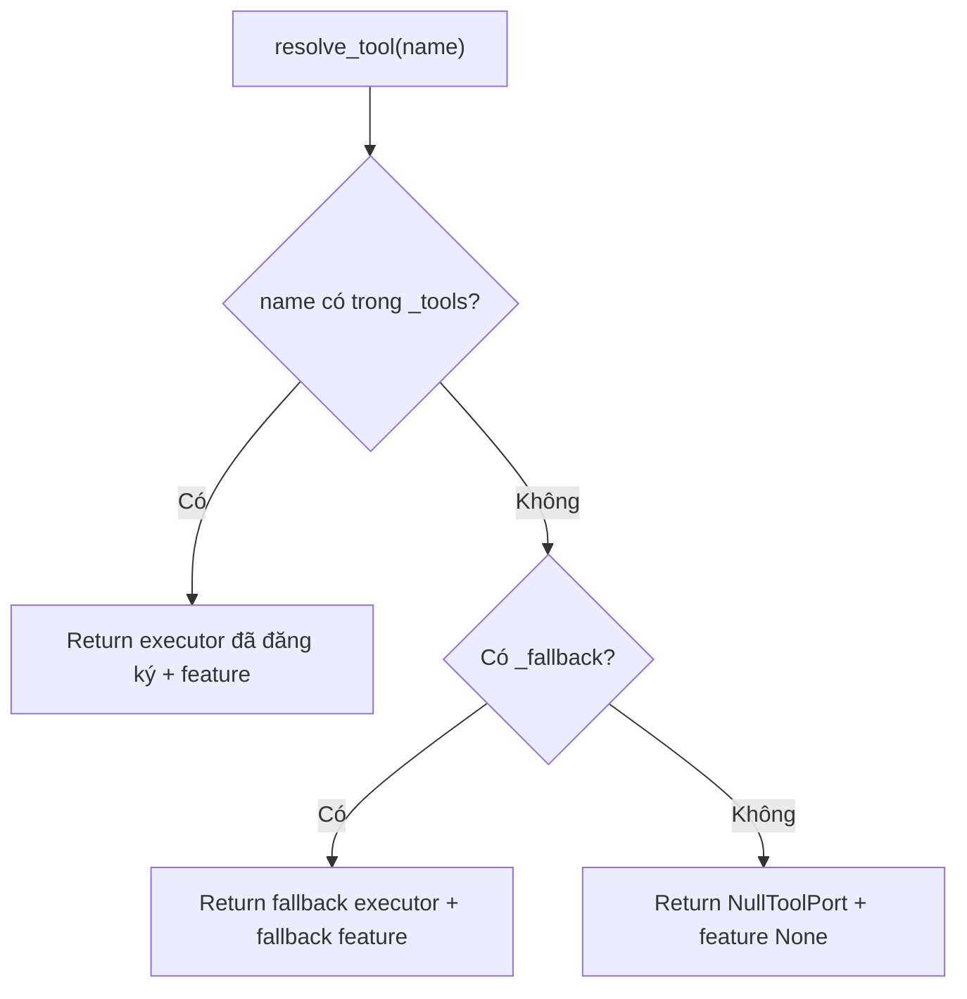

# Giải thích `core/registry.py`

File `core/registry.py` định nghĩa nơi đăng ký và tra cứu capability/tool của agent. Đây là cầu nối giữa kernel và các tool cụ thể: kernel chỉ biết tên tool, còn registry quyết định executor nào sẽ xử lý tên đó.

Nói ngắn gọn: registry là bảng định tuyến capability.

## Vai trò trong architecture

Trong kiến trúc hiện tại, `AgentKernel` không import trực tiếp bất kỳ tool nào. Tool được feature/plugin đăng ký vào `CapabilityRegistry`.

Khi kernel cần chạy:

```python
kernel.execute_tool("echo", {"msg": "hi"})
```

kernel sẽ gọi:

```python
registry.resolve_tool("echo")
```

Registry trả về executor tương ứng, hoặc fallback/null executor nếu không tìm thấy.

Điều này giúp:

- thêm tool mà không sửa kernel,
- tắt/bật feature bằng config,
- giữ kernel không phụ thuộc vào implementation cụ thể,
- xử lý missing tool bằng kết quả có cấu trúc thay vì crash.

## Các import

```python
from __future__ import annotations
```

Bật postponed evaluation cho type annotations.

```python
from typing import Any, NamedTuple
```

- `Any`: dùng vì executor có thể là bất kỳ object nào có method `execute`.
- `NamedTuple`: dùng để tạo object trả về từ `resolve_tool()`.

```python
from core.schemas import FeatureDescriptor, ToolRequest
```

- `FeatureDescriptor`: mô tả feature được đăng ký.
- `ToolRequest`: request object được truyền vào executor.

## Class `ToolResolution`

```python
class ToolResolution(NamedTuple):
    executor: Any
    feature: str | None
```

`ToolResolution` là kết quả của việc resolve một tool name.

Nó gồm:

- `executor`: object sẽ thực thi tool.
- `feature`: tên feature sở hữu tool, hoặc `None` nếu không có.

Ví dụ:

```python
ToolResolution(executor=EchoTool(), feature="example_echo")
```

Ý nghĩa thiết kế: kernel cần cả executor để chạy tool và feature name để ghi metadata vào `CapabilityResult`.

## Class `NullToolPort`

```python
class NullToolPort:
    """Keeps the kernel alive when a tool is missing."""
```

`NullToolPort` là executor mặc định khi tool không tồn tại.

Thay vì raise exception khi gọi tool chưa đăng ký, registry trả về `NullToolPort`. Kernel sau đó vẫn gọi `execute()`, và nhận về lỗi có cấu trúc.

### Field `name`

```python
name = "null_tool"
```

Tên executor dùng cho metadata/debug.

### Method `execute`

```python
def execute(self, request: ToolRequest) -> dict[str, Any]:
```

Nhận một `ToolRequest` và trả về dict lỗi.

```python
return {
    "ok": False,
    "tool": request.name,
    "missing_capability": True,
    "error": f"No tool capability is registered for '{request.name}'.",
}
```

Kết quả có:

- `ok: False`: tool call thất bại.
- `tool`: tên tool được yêu cầu.
- `missing_capability: True`: đánh dấu lỗi do thiếu capability.
- `error`: message mô tả.

Ý nghĩa: thiếu tool là một trạng thái runtime có thể quan sát và xử lý, không phải lỗi làm sập chương trình.

## Class `CapabilityRegistry`

```python
class CapabilityRegistry:
    """Exact registration wins; optional fallback; else NullToolPort."""
```

`CapabilityRegistry` quản lý:

- danh sách tool executor,
- danh sách feature descriptor,
- quan hệ tool -> feature,
- fallback executor tùy chọn,
- null executor mặc định.

Docstring nói rõ thứ tự resolve:

1. Nếu tool được đăng ký chính xác, dùng executor đó.
2. Nếu có fallback executor, dùng fallback.
3. Nếu không có gì, dùng `NullToolPort`.

## Constructor `__init__`

```python
def __init__(self, *, null_tool: Any = None) -> None:
```

`null_tool` là dependency tùy chọn, cho phép inject null tool khác khi test hoặc custom behavior.

### Internal storage

```python
self._tools: dict[str, Any] = {}
self._features: dict[str, FeatureDescriptor] = {}
self._tool_features: dict[str, str] = {}
self._fallback: Any = None
self._fallback_feature: str | None = None
self._null = null_tool or NullToolPort()
```

Ý nghĩa từng field:

- `_tools`: map `tool_name -> executor`.
- `_features`: map `feature_name -> FeatureDescriptor`.
- `_tool_features`: map `tool_name -> feature_name`.
- `_fallback`: executor dùng khi tool không match chính xác.
- `_fallback_feature`: feature name của fallback executor.
- `_null`: executor cuối cùng nếu không có tool và không có fallback.

Các field dùng prefix `_` để biểu thị internal state, không phải API công khai.

## Method `register_feature`

```python
def register_feature(self, descriptor: FeatureDescriptor) -> None:
    self._features[descriptor.name] = descriptor
```

Đăng ký metadata của một feature.

Input là `FeatureDescriptor`, gồm:

- name,
- version,
- capabilities,
- enabled,
- description.

Ví dụ trong `features/example_echo.py`:

```python
kernel.registry.register_feature(FEATURE)
```

Ý nghĩa: registry không chỉ biết tool nào chạy được, mà còn biết feature nào đang được cài.

## Method `register_tool`

```python
def register_tool(self, name: str, executor: Any, *, feature_name: str | None = None) -> None:
```

Đăng ký một tool cụ thể.

```python
self._tools[name] = executor
```

Map tên tool sang executor.

```python
if feature_name:
    self._tool_features[name] = feature_name
```

Nếu có feature name, lưu quan hệ tool -> feature.

Ví dụ:

```python
register_tool("echo", EchoTool(), feature_name="example_echo")
```

Sau đó:

- `resolve_tool("echo")` trả về `EchoTool()`,
- `list_tools()` biết tool `echo` thuộc feature `example_echo`,
- `CapabilityResult` có thể ghi `feature="example_echo"`.

Nếu đăng ký cùng một `name` nhiều lần, executor mới sẽ ghi đè executor cũ. Đây là hành vi "last registration wins".

## Method `register_tools`

```python
def register_tools(self, names, executor: Any, *, feature_name: str | None = None) -> None:
    for name in names:
        self.register_tool(name, executor, feature_name=feature_name)
```

Helper để đăng ký nhiều tool name cho cùng một executor.

Ví dụ:

```python
register_tools(("read_file", "write_file"), FileTool(), feature_name="filesystem")
```

Trong project hiện tại, `example_echo` dùng:

```python
kernel.registry.register_tools(FEATURE.capabilities, EchoTool(), feature_name=FEATURE.name)
```

Ý nghĩa: feature có thể khai báo nhiều capability và đăng ký chúng gọn hơn.

## Method `set_fallback_tool_executor`

```python
def set_fallback_tool_executor(self, executor: Any, *, feature_name: str | None = None) -> None:
```

Đặt fallback executor.

Fallback được dùng khi tool name không có trong `_tools`, nhưng hệ thống vẫn muốn một executor chung xử lý.

```python
self._fallback = executor
self._fallback_feature = feature_name if executor is not None else None
```

Nếu `executor` là `None`, fallback feature cũng bị clear.

Ý nghĩa: fallback có thể dùng cho các kiểu dynamic tool, router tool, hoặc một adapter biết tự xử lý nhiều capability chưa đăng ký tĩnh.

Hiện project chưa dùng fallback này trong smoke test, nhưng registry đã chuẩn bị sẵn cơ chế.

## Method `resolve_tool`

```python
def resolve_tool(self, name: str) -> ToolResolution:
```

Đây là method quan trọng nhất của registry. Nó nhận tool name và trả về `ToolResolution`.

### Ưu tiên 1: tool đăng ký chính xác

```python
if name in self._tools:
    return ToolResolution(self._tools[name], self._tool_features.get(name))
```

Nếu tool tồn tại trong `_tools`, trả executor đó.

Feature lấy từ `_tool_features`, có thể là `None` nếu tool được đăng ký không kèm `feature_name`.

### Ưu tiên 2: fallback executor

```python
if self._fallback is not None:
    return ToolResolution(self._fallback, self._fallback_feature)
```

Nếu không có exact match nhưng đã set fallback, trả fallback.

### Ưu tiên 3: null tool

```python
return ToolResolution(self._null, None)
```

Nếu không có exact match và không có fallback, trả `NullToolPort`.

Ý nghĩa thiết kế: `resolve_tool()` luôn trả về một executor. Nhờ vậy kernel không cần xử lý case `None`, và missing capability được biến thành một tool result thất bại có cấu trúc.

## Method `has_tool`

```python
def has_tool(self, name: str) -> bool:
    return name in self._tools
```

Kiểm tra tool có được đăng ký chính xác không.

Lưu ý: method này không tính fallback. Nếu fallback tồn tại nhưng tool name không có trong `_tools`, `has_tool()` vẫn trả `False`.

Ý nghĩa: dùng cho test hoặc introspection để biết capability cụ thể đã được cài chưa.

## Method `list_tools`

```python
def list_tools(self) -> list[dict[str, Any]]:
    return [{"name": n, "feature": self._tool_features.get(n)} for n in sorted(self._tools)]
```

Trả danh sách tool đã đăng ký, sắp xếp theo tên.

Mỗi item gồm:

- `name`: tên tool,
- `feature`: feature sở hữu tool, nếu có.

Ví dụ:

```python
[
    {"name": "echo", "feature": "example_echo"}
]
```

Ý nghĩa: phục vụ `kernel.describe_capabilities()` và các nhu cầu inspect/debug.

## Method `list_features`

```python
def list_features(self) -> list[dict[str, Any]]:
    return [d.as_dict() for d in self._features.values()]
```

Trả danh sách feature đã đăng ký, convert từng `FeatureDescriptor` thành dict bằng `as_dict()`.

Ý nghĩa: cung cấp metadata feature cho caller, logger, UI hoặc test.

## Luồng resolve tool



## Vì sao registry quan trọng?

### 1. Tách kernel khỏi tool cụ thể

Kernel không cần biết `EchoTool`, `FileTool`, `BrowserTool` hay bất kỳ tool nào. Kernel chỉ gọi registry.

### 2. Feature/plugin có thể tự đăng ký

Mỗi feature chỉ cần có `install(kernel)` và gọi `kernel.registry.register_tool(...)`.

### 3. Missing tool là failure có kiểm soát

`NullToolPort` giúp kernel trả result thất bại thay vì raise exception.

### 4. Dễ introspect

`list_tools()` và `list_features()` cho phép xem runtime hiện có khả năng gì.

## Quan hệ với file khác

- `core/kernel.py`: gọi `resolve_tool()` khi execute tool.
- `core/schemas.py`: cung cấp `FeatureDescriptor` và `ToolRequest`.
- `features/example_echo.py`: đăng ký feature/tool vào registry.
- `tests/test_kernel.py`: kiểm tra registered tool, disabled feature và null fallback.

## Tóm tắt một câu

`core/registry.py` là bảng định tuyến capability của agent: feature đăng ký tool vào đây, kernel resolve tool từ đây, và missing tool được chuyển thành failure có cấu trúc.
