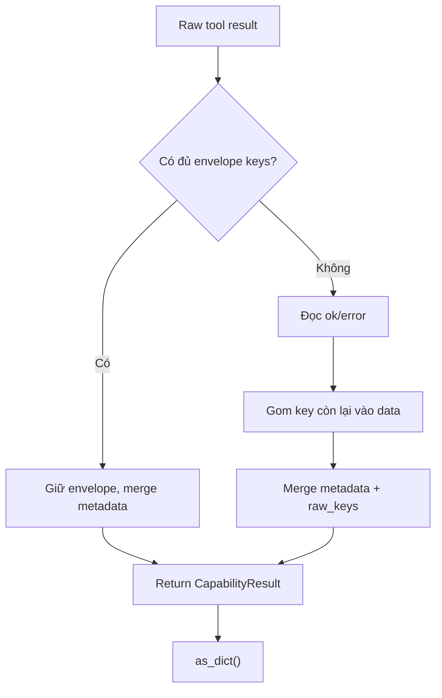

# Giải thích `core/schemas.py`

File `core/schemas.py` định nghĩa các data structure chuẩn dùng trong lõi agent. Đây là nơi đặt hợp đồng dữ liệu giữa task, tool request, tool result và feature metadata.

Nói ngắn gọn: `schemas.py` là ngôn ngữ chung của core.

## Vai trò trong architecture

Các module trong `core/` cần trao đổi dữ liệu với nhau theo format ổn định. Thay vì truyền raw dict/string khắp nơi, project định nghĩa một số schema nhỏ:

- `TaskEnvelope`: bọc task người dùng.
- `ToolRequest`: bọc request gọi tool.
- `CapabilityResult`: bọc kết quả tool theo format thống nhất.
- `FeatureDescriptor`: mô tả feature/plugin.
- `is_capability_result()`: kiểm tra một dict đã là result envelope chuẩn chưa.

Schema này giúp kernel, registry, feature và test cùng nói chung một kiểu dữ liệu.

## Các import

```python
from __future__ import annotations
```

Bật postponed evaluation cho annotation.

```python
import uuid
```

Dùng để sinh id ngẫu nhiên cho task và tool request.

```python
from dataclasses import dataclass, field
from typing import Any
```

- `dataclass`: khai báo object dữ liệu gọn.
- `field`: dùng cho default factory.
- `Any`: dùng cho các payload linh hoạt như context, metadata, data.

## Hằng số `_ENVELOPE_KEYS`

```python
_ENVELOPE_KEYS = {"ok", "capability", "feature", "data", "error", "metadata"}
```

Đây là tập key tối thiểu để một dict được xem là `CapabilityResult` envelope chuẩn.

Một result chuẩn phải có đủ các key:

- `ok`
- `capability`
- `feature`
- `data`
- `error`
- `metadata`

Tên bắt đầu bằng `_` cho thấy đây là chi tiết nội bộ của module.

## Class `TaskEnvelope`

```python
@dataclass(frozen=True)
class TaskEnvelope:
    user_request: str
    context: dict[str, Any] = field(default_factory=dict)
    metadata: dict[str, Any] = field(default_factory=dict)
    task_id: str = field(default_factory=lambda: uuid.uuid4().hex)
```

`TaskEnvelope` bọc yêu cầu gốc từ người dùng.

`frozen=True` nghĩa là object gần như immutable sau khi tạo. Điều này giúp task envelope ổn định hơn, tránh việc bị sửa ngoài ý muốn.

### Field `user_request`

```python
user_request: str
```

Nội dung task gốc.

Ví dụ:

```python
"smoke: echo + discipline"
```

### Field `context`

```python
context: dict[str, Any] = field(default_factory=dict)
```

Context bổ sung cho task. Có thể chứa thông tin môi trường, dữ liệu session, hoặc tham số runtime.

Dùng `default_factory=dict` để mỗi `TaskEnvelope` có dict riêng.

### Field `metadata`

```python
metadata: dict[str, Any] = field(default_factory=dict)
```

Metadata phụ cho task. Khác với `context`, metadata thường dùng cho tracking, tags, hoặc thông tin hệ thống.

Hiện tại kernel chưa dùng nhiều field này, nhưng schema đã chuẩn bị sẵn.

### Field `task_id`

```python
task_id: str = field(default_factory=lambda: uuid.uuid4().hex)
```

Mỗi task tự sinh một id bằng UUID hex.

Ví dụ:

```text
9f1a0e31f3d74fb7a4c0db5c9a9a2e21
```

Ý nghĩa: event log và runtime có thể trace task theo id.

## Class `ToolRequest`

```python
@dataclass(frozen=True)
class ToolRequest:
    name: str
    args: dict[str, Any] = field(default_factory=dict)
    request_id: str = field(default_factory=lambda: uuid.uuid4().hex)
```

`ToolRequest` bọc một lần gọi tool.

### Field `name`

```python
name: str
```

Tên tool/capability cần gọi.

Ví dụ:

```python
"echo"
```

### Field `args`

```python
args: dict[str, Any] = field(default_factory=dict)
```

Tham số truyền vào tool.

Ví dụ:

```python
{"msg": "hi"}
```

### Field `request_id`

```python
request_id: str = field(default_factory=lambda: uuid.uuid4().hex)
```

Id riêng cho từng lần gọi tool.

Ý nghĩa: một task có thể gọi nhiều tool; mỗi call cần id riêng để trace event `tool.requested` và `tool.completed`.

## Function `is_capability_result`

```python
def is_capability_result(result: Any) -> bool:
    return isinstance(result, dict) and _ENVELOPE_KEYS <= set(result)
```

Function này kiểm tra `result` có phải envelope chuẩn chưa.

Điều kiện:

1. `result` phải là dict.
2. Tập `_ENVELOPE_KEYS` phải là subset của các key trong dict.

Toán tử:

```python
_ENVELOPE_KEYS <= set(result)
```

nghĩa là mọi key cần thiết đều có trong `result`.

Ví dụ trả `True`:

```python
{
    "ok": True,
    "capability": "echo",
    "feature": "example_echo",
    "data": {},
    "error": None,
    "metadata": {}
}
```

Ví dụ trả `False`:

```python
{"ok": True, "echo": {"msg": "hi"}}
```

Dict thứ hai chưa phải envelope chuẩn, nên `CapabilityResult.from_raw()` sẽ normalize nó.

## Class `CapabilityResult`

```python
@dataclass(frozen=True)
class CapabilityResult:
    """Uniform envelope every tool call returns."""
```

`CapabilityResult` là schema quan trọng nhất trong file. Nó đảm bảo mọi tool call trả về cùng một format.

### Các field

```python
ok: bool
capability: str
feature: str | None = None
data: dict[str, Any] = field(default_factory=dict)
error: str | None = None
metadata: dict[str, Any] = field(default_factory=dict)
```

Ý nghĩa:

- `ok`: tool call thành công hay thất bại.
- `capability`: tên capability được gọi.
- `feature`: feature sở hữu capability, nếu có.
- `data`: payload chính của kết quả.
- `error`: lỗi nếu thất bại.
- `metadata`: thông tin phụ để trace/debug.

## Classmethod `CapabilityResult.from_raw`

```python
@classmethod
def from_raw(
    cls,
    *,
    capability: str,
    feature: str | None,
    result: dict[str, Any],
    metadata: dict[str, Any] | None = None,
) -> "CapabilityResult":
```

Method này chuyển raw result của tool thành `CapabilityResult`.

Input:

- `capability`: tên capability kernel đang gọi.
- `feature`: feature sở hữu capability.
- `result`: raw dict do executor trả về.
- `metadata`: metadata bổ sung từ kernel, ví dụ `request_id`, `executor`.

### Chuẩn bị metadata phụ

```python
extra = dict(metadata or {})
```

Nếu metadata là `None`, dùng dict rỗng. Nếu có, copy thành dict mới để tránh sửa object bên ngoài.

### Case 1: result đã là envelope chuẩn

```python
if is_capability_result(result):
```

Nếu tool đã trả về đúng format `CapabilityResult`, method không wrap lại theo kiểu raw nữa. Nó chỉ merge metadata.

```python
meta = dict(result.get("metadata") or {})
meta.update(extra)
```

Metadata có sẵn trong result được copy ra, rồi metadata từ kernel ghi đè/bổ sung.

```python
return cls(
    ok=bool(result.get("ok")),
    capability=str(result.get("capability") or capability),
    feature=result.get("feature") if result.get("feature") is not None else feature,
    data=dict(result.get("data") or {}),
    error=result.get("error"),
    metadata=meta,
)
```

Ý nghĩa từng dòng:

- `ok`: ép về bool.
- `capability`: ưu tiên capability trong result, fallback về capability truyền vào.
- `feature`: nếu result có feature khác `None`, dùng nó; nếu không, dùng feature truyền vào.
- `data`: đảm bảo là dict.
- `error`: giữ nguyên error.
- `metadata`: metadata đã merge.

### Case 2: result là raw dict chưa chuẩn

Nếu result chưa có đủ envelope keys, method normalize nó.

```python
ok = bool(result.get("ok", False))
```

Nếu raw result có key `ok`, dùng nó. Nếu không có, mặc định là `False`.

```python
error = None if ok else str(result.get("error") or "Capability execution failed.")
```

Nếu thành công, `error=None`.

Nếu thất bại, lấy `result["error"]` nếu có; nếu không, dùng message mặc định.

```python
data = {k: v for k, v in result.items() if k not in {"ok", "error", "metadata"}}
```

Toàn bộ key không phải `ok`, `error`, `metadata` được gom vào `data`.

Ví dụ raw:

```python
{"ok": True, "echo": {"msg": "hi"}}
```

sẽ thành:

```python
data = {"echo": {"msg": "hi"}}
```

```python
meta = dict(result.get("metadata") or {})
meta.update(extra)
meta.setdefault("raw_keys", sorted(result))
```

Metadata được lấy từ raw result nếu có, merge với metadata ngoài, rồi thêm `raw_keys` nếu chưa có.

`raw_keys` giúp debug tool ban đầu đã trả những key nào.

```python
return cls(ok=ok, capability=capability, feature=feature, data=data, error=error, metadata=meta)
```

Trả về envelope chuẩn.

## Method `as_dict`

```python
def as_dict(self) -> dict[str, Any]:
```

Chuyển `CapabilityResult` dataclass thành dict thường.

```python
return {
    "ok": self.ok,
    "capability": self.capability,
    "feature": self.feature,
    "data": dict(self.data),
    "error": self.error,
    "metadata": dict(self.metadata),
}
```

Kernel dùng:

```python
CapabilityResult.from_raw(...).as_dict()
```

Ý nghĩa: public API của `execute_tool()` trả dict, không trả dataclass. Điều này tiện cho JSON logging, tests, và integration.

## Class `FeatureDescriptor`

```python
@dataclass(frozen=True)
class FeatureDescriptor:
    name: str
    version: str = "0.1"
    capabilities: tuple[str, ...] = ()
    enabled: bool = True
    description: str = ""
```

`FeatureDescriptor` mô tả một feature/plugin.

### Field `name`

Tên feature.

Ví dụ:

```python
"example_echo"
```

### Field `version`

Version feature, mặc định `"0.1"`.

### Field `capabilities`

Tuple tên capability mà feature cung cấp.

Ví dụ:

```python
("echo",)
```

Dùng tuple thay vì list vì dataclass frozen nên dữ liệu nên bất biến.

### Field `enabled`

Cho biết feature đang enabled hay không. Mặc định `True`.

Lưu ý: config loader quyết định feature có được install hay không; field này là metadata của descriptor.

### Field `description`

Mô tả ngắn về feature.

## Method `FeatureDescriptor.as_dict`

```python
def as_dict(self) -> dict[str, Any]:
```

Chuyển descriptor thành dict.

```python
return {
    "name": self.name,
    "version": self.version,
    "capabilities": list(self.capabilities),
    "enabled": self.enabled,
    "description": self.description,
}
```

`capabilities` được convert từ tuple sang list để thân thiện hơn với JSON.

Registry dùng method này trong `list_features()`.

## Luồng normalize result



## Vì sao schemas quan trọng?

### 1. Tạo hợp đồng dữ liệu ổn định

Kernel, registry, feature và observability có thể dựa vào cùng một format.

### 2. Giảm logic đặc biệt theo từng tool

Tool có thể trả raw dict đơn giản, nhưng kernel vẫn normalize thành envelope chuẩn.

### 3. Trace dễ hơn

`task_id`, `request_id`, `capability`, `feature`, `metadata` giúp đọc event log dễ hơn.

### 4. Chuẩn bị cho agent loop

Một agent loop cần dữ liệu ổn định để parse, route, condense, retry và final. `schemas.py` đặt nền cho việc đó.

## Quan hệ với file khác

- `core/kernel.py`: dùng `TaskEnvelope`, `ToolRequest`, `CapabilityResult`.
- `core/registry.py`: dùng `FeatureDescriptor`, `ToolRequest`.
- `features/example_echo.py`: tạo `FeatureDescriptor`, nhận `ToolRequest`.
- `tests/test_kernel.py`: assert result envelope sau khi execute tool.

## Tóm tắt một câu

`core/schemas.py` định nghĩa các hợp đồng dữ liệu cốt lõi của agent, đặc biệt là `CapabilityResult`, giúp mọi tool call được chuẩn hóa thành cùng một envelope.
