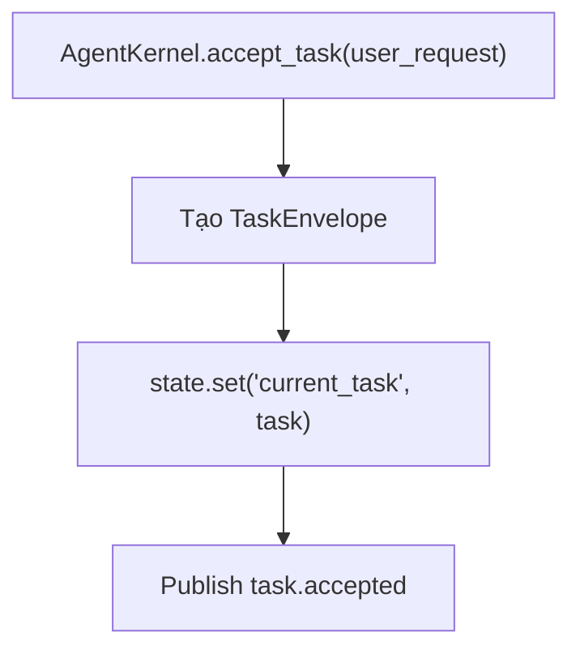

# Giải thích `core/state.py`

File `core/state.py` định nghĩa `StateStore`, một kho key-value đơn giản dùng để giữ state runtime của agent.

Nói ngắn gọn: `state.py` là bộ nhớ tạm trong kernel.

## Vai trò trong architecture

Agent runtime cần một nơi để lưu trạng thái đang chạy, ví dụ:

- task hiện tại,
- trạng thái validation,
- dữ liệu vòng lặp,
- context tạm,
- cờ báo code đã thay đổi,
- kết quả tool gần nhất.

Ở Sprint 0, state store được giữ rất đơn giản: chỉ là một dict bọc trong class.

Kernel hiện dùng state để lưu:

```python
self.state.set("current_task", task)
```

trong `accept_task()`.

## Các import

```python
from __future__ import annotations
```

Bật postponed evaluation cho annotation.

```python
from typing import Any
```

`Any` được dùng vì state có thể chứa nhiều kiểu dữ liệu khác nhau: string, dict, dataclass, bool, list, v.v.

## Class `StateStore`

```python
class StateStore:
```

`StateStore` là wrapper nhỏ quanh dict.

Thay vì để kernel dùng dict trực tiếp, project đặt một class riêng để sau này có thể mở rộng mà không đổi API kernel quá nhiều.

Ví dụ các hướng mở rộng sau này:

- validate key,
- emit event khi state thay đổi,
- snapshot state,
- persist state ra file,
- namespace state theo task/session,
- thêm lock nếu cần thread-safe.

## Constructor `__init__`

```python
def __init__(self) -> None:
    self._data: dict[str, Any] = {}
```

Khi tạo `StateStore`, nó khởi tạo dict rỗng `_data`.

`_data` là internal storage.

Key là `str`, value là `Any`.

## Method `get`

```python
def get(self, key: str, default: Any = None) -> Any:
    return self._data.get(key, default)
```

Lấy giá trị theo key.

Input:

- `key`: tên state cần lấy.
- `default`: giá trị trả về nếu key không tồn tại.

Ví dụ:

```python
task = state.get("current_task")
```

Nếu `"current_task"` chưa tồn tại, trả `None`.

Ví dụ với default:

```python
count = state.get("steps", 0)
```

Nếu `"steps"` chưa tồn tại, trả `0`.

## Method `set`

```python
def set(self, key: str, value: Any) -> None:
    self._data[key] = value
```

Ghi giá trị vào state.

Input:

- `key`: tên state.
- `value`: giá trị cần lưu.

Ví dụ:

```python
state.set("current_task", task)
state.set("validation_passed", True)
```

Method không return gì.

Nếu key đã tồn tại, value cũ bị ghi đè.

## Method `as_dict`

```python
def as_dict(self) -> dict[str, Any]:
    return dict(self._data)
```

Trả về bản copy nông của state hiện tại.

Ví dụ:

```python
snapshot = state.as_dict()
```

Vì dùng `dict(self._data)`, caller nhận một dict mới. Việc thêm/xóa key trong snapshot không làm thay đổi `_data` bên trong.

Lưu ý: đây chỉ là shallow copy. Nếu value bên trong là dict/list/object mutable, object đó vẫn được share reference.

## Luồng dùng hiện tại



## Vì sao không dùng dict trực tiếp?

### 1. Có API rõ ràng

Kernel gọi `state.get()` và `state.set()` thay vì thao tác trực tiếp trên dict.

### 2. Dễ mở rộng

Nếu sau này muốn persist state, log state changes, hoặc validate state key, có thể sửa `StateStore` mà ít ảnh hưởng phần còn lại.

### 3. Dễ inject trong test

Bootstrap tạo `StateStore()` rồi inject vào kernel. Test cũng có thể tạo state riêng.

## Giới hạn hiện tại

`StateStore` hiện tại:

- không thread-safe,
- không persist ra disk,
- không có schema validation,
- không có namespace,
- không có transaction/snapshot sâu.

Đây là lựa chọn hợp lý cho Sprint 0 vì mục tiêu là giữ lõi nhỏ.

## Quan hệ với file khác

- `core/bootstrap.py`: tạo `StateStore` và inject vào `AgentKernel`.
- `core/kernel.py`: dùng state để lưu `current_task`.
- `discipline/finish_gate.py`: dùng state dạng dict để kiểm tra `code_changed` và `validation_passed`, dù chưa nối trực tiếp với `StateStore`.

## Tóm tắt một câu

`core/state.py` cung cấp một key-value store tối giản để kernel lưu state runtime, hiện dùng cho `current_task` và sẵn sàng mở rộng cho agent loop sau này.
