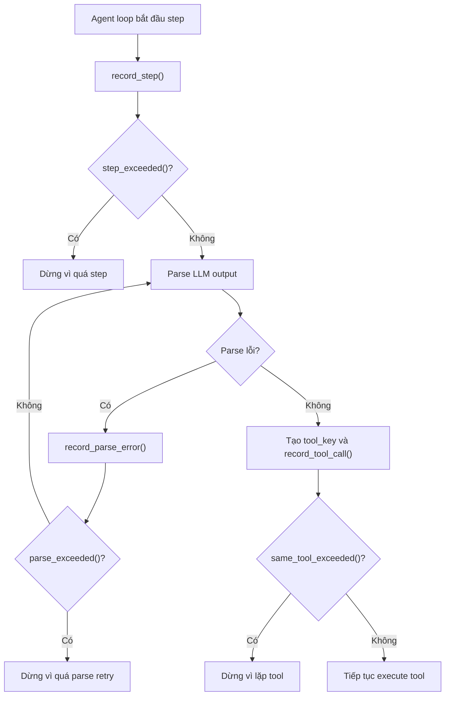

# Giải thích `discipline/budget.py`

File `discipline/budget.py` định nghĩa `Budget`, một object nhỏ dùng để kiểm soát giới hạn của agent loop: số bước, số lỗi parse JSON, và số lần gọi lặp cùng một tool với cùng args.

Nói ngắn gọn: `budget.py` là bộ đếm giới hạn để agent không chạy vô hạn.

## Vai trò trong architecture

Khi agent loop hoàn chỉnh được nối lại, vòng lặp thường có dạng:

```text
LLM -> parse action -> gọi tool -> feed result lại LLM -> lặp
```

Nếu không có budget, agent có thể:

- gọi tool mãi,
- parse lỗi mãi,
- lặp cùng một action,
- tiêu tốn quá nhiều step.

`Budget` đặt giới hạn cho các tình huống đó.

## Docstring đầu file

```python
"""Loop budgets - steps, parse-errors, same-tool repeats (parse errors do not consume steps). Epic E02."""
```

Module này thuộc Epic E02, nhóm output discipline.

Điểm quan trọng trong docstring: lỗi parse không consume step budget. Nghĩa là retry sửa JSON được tính riêng với step thật.

## Các import

```python
from __future__ import annotations
from dataclasses import dataclass, field
from typing import Any
```

- `dataclass`: tạo class dữ liệu gọn.
- `field`: tạo default factory cho dict `_tool_calls`.
- `Any`: args của tool có thể chứa nhiều kiểu dữ liệu.

## Class `Budget`

```python
@dataclass
class Budget:
    """Loop control. Parse-error retries do NOT consume the step budget."""
```

`Budget` là dataclass mutable. Các counter như `steps` và `parse_errors` sẽ tăng dần trong quá trình chạy.

## Các field cấu hình

```python
max_steps: int = 30
max_parse_errors: int = 3
max_same_tool_calls: int = 3
```

Ý nghĩa:

- `max_steps`: số step tối đa agent được chạy.
- `max_parse_errors`: số lỗi parse JSON tối đa trước khi dừng.
- `max_same_tool_calls`: số lần tối đa cho cùng một tool call key.

## Các field trạng thái

```python
steps: int = 0
parse_errors: int = 0
_tool_calls: dict[str, int] = field(default_factory=dict)
```

- `steps`: số step đã ghi nhận.
- `parse_errors`: số lỗi parse đã ghi nhận.
- `_tool_calls`: map từ key tool call sang số lần gọi.

`default_factory=dict` đảm bảo mỗi `Budget` có dict riêng.

## Method `record_step`

```python
def record_step(self) -> None:
    self.steps += 1
```

Tăng số step lên 1.

Agent loop sẽ gọi method này khi một step thật được thực hiện, ví dụ sau khi LLM action hợp lệ được xử lý.

## Method `step_exceeded`

```python
def step_exceeded(self) -> bool:
    return self.steps > self.max_steps
```

Kiểm tra step đã vượt quá giới hạn chưa.

Lưu ý dùng `>` chứ không phải `>=`. Với `max_steps=30`, trạng thái `steps == 30` chưa bị coi là exceeded; `steps == 31` mới exceeded.

## Method `record_parse_error`

```python
def record_parse_error(self) -> None:
    self.parse_errors += 1
```

Tăng counter lỗi parse JSON.

Quan trọng: method này không tăng `steps`. Đây là behavior được test trong `tests/test_discipline.py`.

## Method `parse_exceeded`

```python
def parse_exceeded(self) -> bool:
    return self.parse_errors >= self.max_parse_errors
```

Kiểm tra lỗi parse đã chạm giới hạn chưa.

Ở đây dùng `>=`. Với `max_parse_errors=3`, đến lỗi thứ ba là exceeded.

## Method `record_tool_call`

```python
def record_tool_call(self, key: str) -> int:
    self._tool_calls[key] = self._tool_calls.get(key, 0) + 1
    return self._tool_calls[key]
```

Ghi nhận một lần gọi tool theo key.

Trả về số lần key đó đã được gọi.

Key thường được tạo bằng `Budget.tool_key(tool_name, args)`.

## Method `same_tool_exceeded`

```python
def same_tool_exceeded(self, key: str) -> bool:
    return self._tool_calls.get(key, 0) > self.max_same_tool_calls
```

Kiểm tra cùng một tool call đã vượt quá giới hạn chưa.

Tương tự step, dùng `>`: nếu max là 3 thì lần thứ 4 mới exceeded.

## Static method `tool_key`

```python
@staticmethod
def tool_key(tool_name: str, args: dict[str, Any]) -> str:
    import json

    return tool_name + ":" + json.dumps(args, sort_keys=True, ensure_ascii=False)
```

Tạo key ổn định cho một tool call dựa trên:

- tên tool,
- args đã serialize JSON.

`sort_keys=True` giúp args cùng nội dung nhưng thứ tự key khác nhau vẫn tạo cùng key.

Ví dụ:

```python
Budget.tool_key("echo", {"a": 1})
```

trả dạng:

```text
echo:{"a": 1}
```

`ensure_ascii=False` giữ Unicode readable trong key.

## Luồng dùng dự kiến



## Ý nghĩa thiết kế

### 1. Tách riêng loại budget

Step, parse error và same-tool repeat được đếm riêng. Điều này giúp lỗi JSON không ăn hết step thật.

### 2. Chống vòng lặp vô hạn

Same-tool budget bắt các vòng lặp kiểu model cứ gọi cùng một tool với cùng args.

### 3. Dễ test và cấu hình

`Budget(max_steps=3, max_parse_errors=2)` có thể tạo trực tiếp trong test.

## Quan hệ với file khác

- `discipline/__init__.py`: export `Budget`.
- `tests/test_discipline.py`: kiểm tra parse errors không tăng steps và same-tool exceeded.
- Agent loop tương lai sẽ dùng `Budget` cùng `parse_action`, `condense`, `check_finish`.

## Tóm tắt một câu

`discipline/budget.py` cung cấp bộ đếm giới hạn cho agent loop, giúp kiểm soát số step, lỗi parse và lặp tool để runtime không chạy vô hạn.
