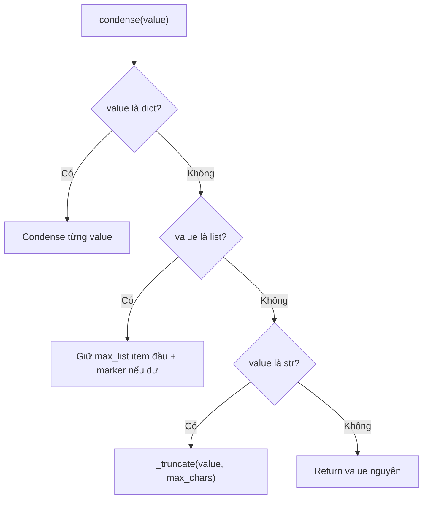

# Giải thích `discipline/condense.py`

File `discipline/condense.py` định nghĩa logic rút gọn dữ liệu trước khi đưa kết quả tool quay lại LLM. Nó xử lý dict, list và string theo cách đệ quy.

Nói ngắn gọn: `condense.py` giúp context không phình quá lớn.

## Vai trò trong architecture

Tool result có thể rất lớn:

- file dài,
- output command nhiều dòng,
- danh sách hàng trăm item,
- JSON response lớn.

Nếu feed nguyên kết quả đó lại cho LLM, agent có thể tốn context, chậm, hoặc vượt giới hạn token. `condense()` cắt bớt string/list nhưng vẫn giữ hình dạng dữ liệu cơ bản.

## Docstring đầu file

```python
"""Condense large tool results before re-feeding them to the model. Epic E02."""
```

Module này thuộc Epic E02, lớp output discipline.

## Các import

```python
from __future__ import annotations
from typing import Any
```

`Any` dùng vì dữ liệu cần condense có thể là dict, list, string, number, bool, `None`, v.v.

## Helper `_truncate`

```python
def _truncate(text: str, max_chars: int) -> str:
```

Helper nội bộ để cắt string dài.

### Nếu text chưa vượt giới hạn

```python
if len(text) <= max_chars:
    return text
```

String ngắn được giữ nguyên.

### Nếu text quá dài

```python
return text[:max_chars] + f"... [+{len(text) - max_chars} chars]"
```

Giữ `max_chars` ký tự đầu, rồi thêm marker cho biết đã cắt bao nhiêu ký tự.

Ví dụ với `max_chars=5`:

```python
_truncate("abcdefghij", 5)
```

trả:

```text
abcde... [+5 chars]
```

Marker này quan trọng vì người đọc/model biết dữ liệu đã bị rút gọn.

## Function `condense`

```python
def condense(value: Any, *, max_chars: int = 2000, max_list: int = 10) -> Any:
    """Shrink a tool result before re-feeding it to the model."""
```

Input:

- `value`: dữ liệu bất kỳ cần rút gọn.
- `max_chars`: giới hạn ký tự cho string.
- `max_list`: số item đầu giữ lại trong list.

Output:

- dữ liệu đã rút gọn, giữ gần giống cấu trúc ban đầu.

## Case dict

```python
if isinstance(value, dict):
    return {k: condense(v, max_chars=max_chars, max_list=max_list) for k, v in value.items()}
```

Nếu value là dict, function giữ nguyên key và condense từng value đệ quy.

Ví dụ:

```python
condense({"text": "x" * 5000}, max_chars=100)
```

sẽ cắt value của key `"text"`.

## Case list

```python
if isinstance(value, list):
    head = [condense(v, max_chars=max_chars, max_list=max_list) for v in value[:max_list]]
    if len(value) > max_list:
        head.append(f"... [+{len(value) - max_list} items]")
    return head
```

Nếu value là list:

1. giữ `max_list` item đầu,
2. condense từng item đệ quy,
3. nếu list dài hơn, thêm marker cuối list.

Ví dụ:

```python
condense({"items": list(range(50))}, max_list=5)
```

trả list có 6 phần tử:

- 5 item đầu,
- marker `"... [+45 items]"`.

## Case string

```python
if isinstance(value, str):
    return _truncate(value, max_chars)
```

String được cắt bằng `_truncate`.

## Case còn lại

```python
return value
```

Các kiểu khác được giữ nguyên:

- int,
- float,
- bool,
- `None`,
- object không phải dict/list/string.

## Luồng condense



## Ý nghĩa thiết kế

### 1. Giữ cấu trúc

Dict vẫn là dict, list vẫn là list. Agent/model vẫn thấy shape dữ liệu.

### 2. Cắt có dấu vết

Marker `"[+N chars]"` và `"[+N items]"` cho biết đã bị rút gọn bao nhiêu.

### 3. Đệ quy đơn giản

Nested dict/list/string cũng được xử lý mà không cần logic riêng.

## Giới hạn hiện tại

`condense()` hiện:

- không đo token thật, chỉ đo ký tự/item,
- không summarize semantic,
- không xử lý tuple/set riêng,
- không giới hạn depth.

Với Sprint 0, đây là lựa chọn đơn giản và dễ test.

## Quan hệ với file khác

- `discipline/__init__.py`: export `condense`.
- `tests/test_discipline.py`: kiểm tra string bị truncate và list bị cắt.
- Agent loop tương lai sẽ dùng `condense()` trước khi feed tool result lại cho LLM.

## Tóm tắt một câu

`discipline/condense.py` rút gọn tool result một cách đệ quy để giảm context, cắt string/list lớn nhưng vẫn giữ shape dữ liệu và marker phần bị lược bỏ.
