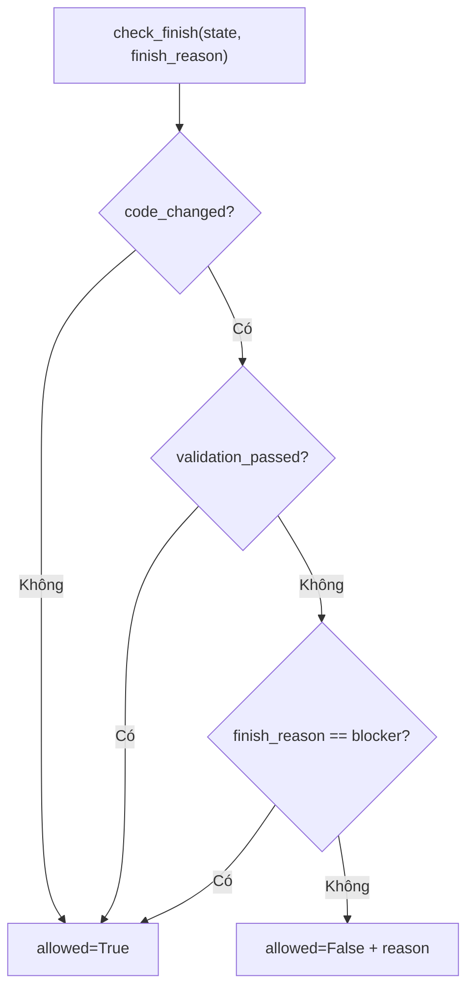

# Giải thích `discipline/finish_gate.py`

File `discipline/finish_gate.py` định nghĩa gate kiểm tra trước khi agent được phép kết thúc bằng final answer. Quy tắc chính: nếu code đã thay đổi mà chưa có validation pass, không được final trừ khi khai báo blocker.

Nói ngắn gọn: `finish_gate.py` ngăn agent kết thúc quá sớm sau khi sửa code.

## Vai trò trong architecture

Một coding agent có thể sửa file rồi trả lời ngay mà chưa chạy kiểm tra. Điều này rủi ro. Finish gate tạo một chốt kiểm soát:

```text
code_changed=True + validation_passed=False => block final
```

Trừ trường hợp agent báo rõ:

```text
finish_reason="blocker"
```

Khi đó final được phép vì agent đang nói rằng nó bị chặn và không thể validate.

## Docstring đầu file

```python
"""Finish gate - block a final when code changed but no validation passed. Epic E02."""
```

Module thuộc Epic E02, lớp output discipline.

## Các import

```python
from __future__ import annotations
from typing import Any
```

`Any` dùng vì state là dict linh hoạt.

## Function `requires_validation`

```python
def requires_validation(state: dict[str, Any]) -> bool:
    return bool(state.get("code_changed"))
```

Kiểm tra state có yêu cầu validation không.

Hiện logic rất đơn giản:

- nếu `state["code_changed"]` truthy, cần validation,
- nếu không, không cần.

Ví dụ:

```python
requires_validation({"code_changed": True})  # True
requires_validation({"code_changed": False}) # False
requires_validation({})                      # False
```

## Function `has_passing_validation`

```python
def has_passing_validation(state: dict[str, Any]) -> bool:
    return bool(state.get("validation_passed"))
```

Kiểm tra validation đã pass chưa.

Hiện logic:

- nếu `state["validation_passed"]` truthy, coi là pass,
- nếu thiếu hoặc falsy, coi là chưa pass.

## Function `check_finish`

```python
def check_finish(state: dict[str, Any], finish_reason: str | None = None) -> dict[str, Any]:
    """Block a `final` when code changed but no passing validation (unless a blocker is declared)."""
```

Đây là API chính của module.

Input:

- `state`: dict trạng thái runtime.
- `finish_reason`: lý do kết thúc, ví dụ `"validated"` hoặc `"blocker"`.

Output:

```python
{"allowed": bool, "reason": str}
```

## Điều kiện block

```python
if requires_validation(state) and not has_passing_validation(state) and finish_reason != "blocker":
```

Final bị chặn khi cả ba điều kiện đúng:

1. code đã thay đổi,
2. validation chưa pass,
3. finish reason không phải `"blocker"`.

## Response khi bị block

```python
return {
    "allowed": False,
    "reason": "Code changed but no passing validation. Validate or finish with finish_reason='blocker'.",
}
```

`allowed=False` cho agent loop biết không được final.

`reason` giải thích cách xử lý:

- validate,
- hoặc finish với blocker nếu thật sự bị chặn.

## Response khi được phép

```python
return {"allowed": True, "reason": ""}
```

Nếu không cần validation, hoặc validation đã pass, hoặc finish reason là blocker, final được phép.

## Bảng hành vi

| `code_changed` | `validation_passed` | `finish_reason` | Kết quả |
|---|---:|---|---|
| `False` | `False` | bất kỳ | allowed |
| `True` | `True` | bất kỳ | allowed |
| `True` | `False` | `"blocker"` | allowed |
| `True` | `False` | khác `"blocker"` | blocked |

## Luồng finish gate



## Ý nghĩa thiết kế

### 1. Validation là điều kiện trước khi final

Agent sửa code thì phải có bằng chứng validation hoặc báo blocker.

### 2. Rule nhỏ, dễ test

Logic được tách thành ba function nhỏ và có test rõ.

### 3. Không phụ thuộc kernel

Function nhận dict state thuần. Nó có thể dùng với `StateStore.as_dict()` hoặc bất kỳ state object nào được convert thành dict.

## Quan hệ với file khác

- `discipline/__init__.py`: export `check_finish`, `has_passing_validation`, `requires_validation`.
- `tests/test_discipline.py`: kiểm tra block, allow blocker và allow validated.
- Agent loop tương lai sẽ gọi `check_finish()` khi model muốn action `final`.

## Tóm tắt một câu

`discipline/finish_gate.py` là chốt an toàn trước final: nếu code đã đổi mà chưa validate pass thì chặn, trừ khi agent kết thúc vì blocker rõ ràng.
