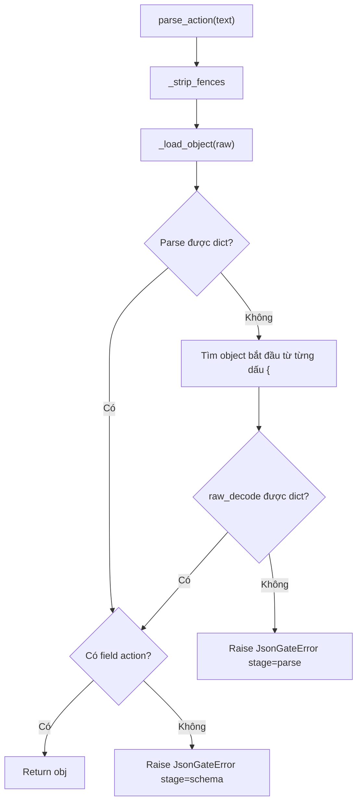

# Giải thích `discipline/json_gate.py`

File `discipline/json_gate.py` xử lý việc parse output của LLM thành một JSON action object. Nó có thể bỏ markdown fence, sửa một số lỗi JSON phổ biến, trích object JSON nằm lẫn trong prose, và raise lỗi có cấu trúc nếu không parse được.

Nói ngắn gọn: `json_gate.py` là cổng kiểm soát output JSON của model.

## Vai trò trong architecture

Agent loop dự kiến cần LLM trả action dạng JSON:

```json
{"action": "tool", "tool": "echo", "args": {}}
```

Nhưng model có thể trả:

- JSON trong markdown fence,
- trailing comma,
- thiếu dấu đóng brace,
- prose kèm JSON,
- object thiếu field `action`,
- text không phải JSON.

`parse_action()` cố gắng sửa các lỗi nhẹ, nhưng nếu không đủ điều kiện thì raise `JsonGateError` để loop có thể retry hoặc dừng.

## Docstring đầu file

```python
"""Parse + repair the model's JSON action; raise JsonGateError on failure. Epic E02."""
```

Module thuộc Epic E02, output discipline.

## Các import

```python
from __future__ import annotations
import json
import re
from typing import Any
```

- `json`: parse JSON chuẩn.
- `re`: xử lý markdown fence, trailing comma và tìm `{`.
- `Any`: action object là dict linh hoạt.

## Class `JsonGateError`

```python
class JsonGateError(ValueError):
```

Exception riêng cho lỗi JSON gate.

Nó kế thừa `ValueError`, nhưng bổ sung metadata:

- `stage`,
- `candidate`.

### Constructor

```python
def __init__(self, message: str, *, stage: str = "parse", candidate: str = "") -> None:
    super().__init__(message)
    self.stage = stage
    self.candidate = candidate
```

Input:

- `message`: message lỗi.
- `stage`: giai đoạn lỗi, mặc định `"parse"`.
- `candidate`: đoạn text/object candidate để debug.

Ví dụ:

- parse không ra JSON: `stage="parse"`,
- JSON parse được nhưng thiếu field `action`: `stage="schema"`.

## Helper `_strip_fences`

```python
def _strip_fences(text: str) -> str:
```

Bỏ markdown code fence nếu output bắt đầu bằng triple backticks.

### Trim text

```python
t = text.strip()
```

Xóa whitespace đầu/cuối.

### Nếu bắt đầu bằng fence

```python
if t.startswith("```"):
    t = re.sub(r"^```[a-zA-Z0-9]*", "", t).strip()
    t = re.sub(r"```$", "", t).strip()
```

Xóa fence mở như:

```text
```json
```

và fence đóng cuối string.

Ví dụ:

```text
```json
{"action": "final"}
```
```

thành:

```json
{"action": "final"}
```

## Helper `_repair`

```python
def _repair(candidate: str) -> str:
```

Sửa một số lỗi JSON phổ biến.

### Xóa trailing comma

```python
fixed = re.sub(r",\s*([}\]])", r"\1", candidate)
```

Chuyển:

```json
{"action": "final",}
```

thành:

```json
{"action": "final"}
```

Tương tự với list:

```json
[1, 2,]
```

### Cân bằng bracket/brace ngoài string

Function duyệt từng ký tự, theo dõi:

- `stack`: các bracket/brace đang mở,
- `in_string`: có đang ở trong string JSON không,
- `escaped`: ký tự trước có phải backslash không.

Ý nghĩa: chỉ đếm `{`, `[`, `}`, `]` khi không nằm trong string.

Cuối cùng:

```python
closing = {"{": "}", "[": "]"}
return fixed + "".join(closing[item] for item in reversed(stack))
```

Nếu còn `{` hoặc `[` chưa đóng, thêm dấu đóng tương ứng vào cuối.

Ví dụ:

```json
{"action": "final"
```

có thể được repair thành:

```json
{"action": "final"}
```

## Helper `_load_object`

```python
def _load_object(text: str) -> dict[str, Any] | None:
```

Thử parse text thành dict JSON.

```python
for variant in (text, _repair(text)):
```

Thử hai variant:

1. text gốc,
2. text đã repair.

```python
try:
    parsed = json.loads(variant)
except json.JSONDecodeError:
    continue
if isinstance(parsed, dict):
    return parsed
```

Chỉ chấp nhận parsed object nếu là dict.

Nếu parse ra list/string/number thì không đủ điều kiện action object.

Nếu mọi variant đều fail, trả `None`.

## Function `parse_action`

```python
def parse_action(text: str) -> dict[str, Any]:
    """Parse one JSON action object from model output, repairing common breakage."""
```

Đây là API chính.

Input:

- raw output từ LLM.

Output:

- dict action object có field `"action"`.

Nếu fail:

- raise `JsonGateError`.

## Bước 1: strip fence

```python
raw = _strip_fences(text or "")
```

Nếu `text` là `None` hoặc falsy, dùng string rỗng.

Sau đó bỏ markdown fence nếu có.

## Bước 2: parse toàn bộ raw

```python
obj = _load_object(raw)
```

Thử parse raw hoặc raw đã repair.

## Bước 3: nếu chưa parse được, trích object embedded

```python
if obj is None:
    decoder = json.JSONDecoder()
    for match in re.finditer(r"\{", raw):
        for variant in (raw[match.start():], _repair(raw[match.start():])):
            try:
                parsed, _ = decoder.raw_decode(variant)
            except json.JSONDecodeError:
                continue
            if isinstance(parsed, dict):
                obj = parsed
                break
        if obj is not None:
            break
```

Nếu raw không phải JSON thuần, function tìm từng vị trí có `{` và thử decode từ đó.

Điều này xử lý output kiểu:

```text
action: {"action":"final","message":"x"} thanks
```

`raw_decode()` có thể parse object đầu tiên và bỏ qua phần text sau đó.

## Bước 4: nếu vẫn không có object

```python
if obj is None:
    raise JsonGateError("Could not parse a JSON object from model output.", candidate=raw[:200])
```

Raise lỗi parse.

`candidate` chỉ giữ 200 ký tự đầu để debug mà không kéo theo output quá dài.

## Bước 5: kiểm tra schema tối thiểu

```python
if "action" not in obj:
    raise JsonGateError("Missing required 'action' field.", stage="schema", candidate=str(obj)[:200])
```

JSON object phải có key `action`.

Nếu thiếu, lỗi ở stage `"schema"` chứ không phải `"parse"`.

## Bước 6: trả action object

```python
return obj
```

Object có thể chứa các field khác như:

- `tool`,
- `args`,
- `message`,
- `finish_reason`.

`parse_action()` chỉ enforce field tối thiểu `action`.

## Function `build_retry_message`

```python
def build_retry_message(error: JsonGateError) -> str:
```

Tạo message để gửi lại model khi output trước đó không hợp lệ.

```python
return (
    "Your previous output was not a valid action object "
    f"(stage={error.stage}). Return exactly ONE JSON object with an 'action' field "
    "and no markdown fences or prose."
)
```

Message nhắc model:

- output trước không hợp lệ,
- stage lỗi là gì,
- trả đúng một JSON object,
- phải có field `action`,
- không markdown fence,
- không prose.

## Luồng parse action



## Ý nghĩa thiết kế

### 1. Tolerant nhưng không dễ dãi quá mức

Gate sửa lỗi nhẹ như fence/trailing comma/bracket thiếu, nhưng vẫn yêu cầu object và field `action`.

### 2. Lỗi có stage

Loop có thể biết lỗi do parse hay schema để retry chính xác hơn.

### 3. Hỗ trợ JSON lẫn trong prose

Điều này thực tế hữu ích vì model hay trả thêm lời dẫn dù đã yêu cầu JSON.

## Quan hệ với file khác

- `discipline/__init__.py`: export `parse_action`, `JsonGateError`, `build_retry_message`.
- `llm/adapter.py`: khi lỗi LLM, adapter trả JSON string có `action="final"` để parse được.
- `tests/test_discipline.py`: kiểm tra clean JSON, fence/trailing comma, embedded object, missing action và garbage.
- `tests/test_llm_adapter.py`: dùng `parse_action()` để parse error final từ LLM adapter.

## Tóm tắt một câu

`discipline/json_gate.py` là cổng parse output LLM thành JSON action object, có repair nhẹ, extract object embedded, và lỗi có cấu trúc khi output không đạt schema tối thiểu.
