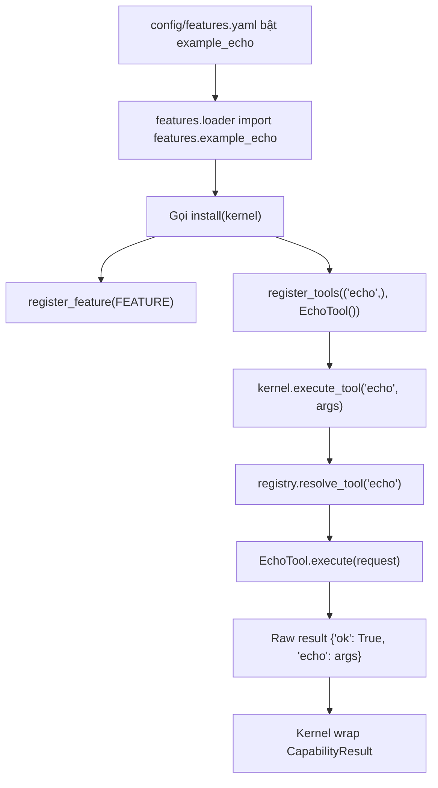

# Giải thích `features/example_echo.py`

File `features/example_echo.py` là một feature mẫu cung cấp tool `echo`. Tool này chỉ trả lại args nhận được, nhưng nó rất quan trọng vì minh họa toàn bộ pattern để viết feature/plugin trong project.

Nói ngắn gọn: `example_echo.py` là feature mẫu để test registry, kernel và smoke flow.

## Vai trò trong architecture

Feature này chứng minh cơ chế plugin hoạt động:

1. feature khai báo metadata bằng `FeatureDescriptor`,
2. feature implement tool executor,
3. feature expose `install(kernel)`,
4. loader gọi `install(kernel)`,
5. feature đăng ký tool vào `kernel.registry`,
6. kernel có thể gọi `execute_tool("echo", args)`.

Dù `echo` rất đơn giản, nó là mẫu chuẩn cho feature thật sau này.

## Docstring đầu file

```python
"""Example feature - an echo tool used by smoke/tests and as the plugin pattern. Epic E01."""
```

Docstring nói rõ module này:

- là example feature,
- cung cấp echo tool,
- dùng trong smoke/test,
- làm mẫu plugin pattern,
- thuộc Epic E01.

## Các import

```python
from __future__ import annotations
```

Bật postponed evaluation cho type annotations.

```python
from typing import Any
```

`Any` dùng cho dict result của tool.

```python
from core.kernel import AgentKernel
from core.schemas import FeatureDescriptor, ToolRequest
```

- `AgentKernel`: type của kernel truyền vào `install`.
- `FeatureDescriptor`: metadata mô tả feature.
- `ToolRequest`: request object mà executor nhận khi chạy tool.

## Hằng số `FEATURE`

```python
FEATURE = FeatureDescriptor(
    name="example_echo",
    capabilities=("echo",),
    description="Trivial echo tool used by smoke tests and as a feature-plugin example.",
)
```

`FEATURE` mô tả feature này.

### `name`

```python
name="example_echo"
```

Tên feature là `example_echo`.

Tên này được registry lưu lại và xuất hiện trong `CapabilityResult["feature"]`.

### `capabilities`

```python
capabilities=("echo",)
```

Feature này cung cấp một capability tên `echo`.

Tuple có dấu phẩy vì đây là tuple một phần tử.

### `description`

```python
description="Trivial echo tool used by smoke tests and as a feature-plugin example."
```

Mô tả ngắn cho introspection/debug.

## Class `EchoTool`

```python
class EchoTool:
    name = "echo_tool"
```

`EchoTool` là executor thực tế cho capability `echo`.

Nó không kế thừa `ToolPort`, nhưng vẫn thỏa protocol vì có:

- attribute `name`,
- method `execute(request)`.

### Attribute `name`

```python
name = "echo_tool"
```

Tên executor.

Kernel dùng tên này trong metadata:

```python
"executor": "echo_tool"
```

## Method `EchoTool.execute`

```python
def execute(self, request: ToolRequest) -> dict[str, Any]:
    return {"ok": True, "echo": dict(request.args)}
```

Method này nhận `ToolRequest` và trả về dict.

Input:

- `request.name`: tên tool được gọi, ở đây thường là `"echo"`.
- `request.args`: args truyền từ caller.
- `request.request_id`: id của lần gọi tool.

Output:

```python
{"ok": True, "echo": dict(request.args)}
```

Ví dụ nếu caller gọi:

```python
kernel.execute_tool("echo", {"msg": "hi"})
```

tool trả raw result:

```python
{"ok": True, "echo": {"msg": "hi"}}
```

Sau đó kernel normalize thành `CapabilityResult`:

```python
{
    "ok": True,
    "capability": "echo",
    "feature": "example_echo",
    "data": {"echo": {"msg": "hi"}},
    "error": None,
    "metadata": {
        "request_id": "...",
        "executor": "echo_tool",
        "raw_keys": ["echo", "ok"]
    }
}
```

`dict(request.args)` tạo copy nông của args để result không giữ reference trực tiếp tới dict gốc.

## Function `install`

```python
def install(kernel: AgentKernel) -> None:
    kernel.registry.register_feature(FEATURE)
    kernel.registry.register_tools(FEATURE.capabilities, EchoTool(), feature_name=FEATURE.name)
```

Đây là contract chính của feature module.

Feature loader yêu cầu mỗi module feature enabled phải có `install(kernel)`.

### Đăng ký feature metadata

```python
kernel.registry.register_feature(FEATURE)
```

Lưu `FeatureDescriptor` vào registry.

Nhờ đó `kernel.describe_capabilities()` có thể hiển thị feature `example_echo`.

### Đăng ký tool/capability

```python
kernel.registry.register_tools(FEATURE.capabilities, EchoTool(), feature_name=FEATURE.name)
```

Đăng ký tất cả capability trong `FEATURE.capabilities` vào registry.

Ở đây chỉ có một capability:

```python
"echo"
```

Executor là:

```python
EchoTool()
```

Feature name là:

```python
"example_echo"
```

Sau dòng này, registry biết:

```text
echo -> EchoTool() -> feature example_echo
```

## Luồng chạy echo



## Ý nghĩa thiết kế

### 1. Đây là mẫu plugin nhỏ nhất

Feature thật sau này có thể copy pattern này:

- tạo `FEATURE`,
- tạo executor,
- tạo `install(kernel)`,
- đăng ký vào registry.

### 2. Test được kernel mà không cần LLM/network

`echo` deterministic và offline, nên rất hợp cho smoke test.

### 3. Chứng minh registry hoạt động

Nếu `echo` được gọi thành công, nghĩa là config, loader, install, registry và kernel đều nối đúng.

### 4. Raw result đơn giản nhưng vẫn được normalize

Tool không cần tự tạo full `CapabilityResult`. Kernel làm việc đó.

## Quan hệ với file khác

- `config/features.yaml`: bật module `features.example_echo`.
- `features/loader.py`: import module và gọi `install(kernel)`.
- `core/registry.py`: nhận đăng ký feature/tool.
- `core/kernel.py`: resolve và execute `echo`.
- `run_smoke.py`: gọi `kernel.execute_tool("echo", {"msg": "hi"})`.
- `tests/test_kernel.py`: kiểm tra `echo` được đăng ký và chạy đúng.

## Tóm tắt một câu

`features/example_echo.py` là feature mẫu tối giản: khai báo capability `echo`, implement executor trả lại args, và đăng ký vào kernel qua `install(kernel)`.
