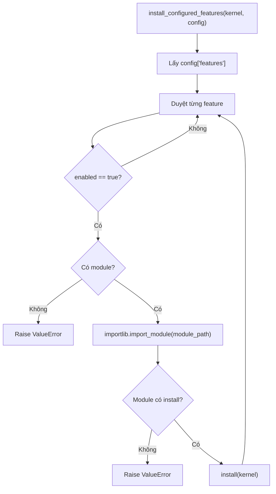

# Giải thích `features/loader.py`

File `features/loader.py` là bộ nạp feature/plugin theo config. Nó đọc phần `features` trong config, bỏ qua feature đang tắt, import module feature được bật, rồi gọi hàm `install(kernel)` của module đó.

Nói ngắn gọn: `loader.py` là cầu nối giữa `config/features.yaml` và `CapabilityRegistry` trong kernel.

## Vai trò trong architecture

Project này muốn kernel không biết trực tiếp các feature cụ thể. Kernel chỉ có registry. Feature nào được bật, module nào được import, tool nào được đăng ký là trách nhiệm của feature loader.

Luồng tổng quát:

```text
config/features.yaml -> features.loader -> import module -> install(kernel) -> registry.register_tools(...)
```

Nhờ vậy có thể thêm feature mới bằng cách:

1. tạo module feature,
2. module đó có hàm `install(kernel)`,
3. thêm module vào `config/features.yaml`.

Kernel không cần sửa.

## Docstring đầu file

```python
"""Install the features that are enabled in config['features']. Epic E01."""
```

Docstring nói mục đích của module:

- cài các feature được bật trong `config["features"]`,
- thuộc Epic E01, tức phần kernel/capability registry nền tảng.

## Các import

```python
from __future__ import annotations
```

Bật postponed evaluation cho type annotations.

```python
import importlib
```

`importlib` cho phép import module bằng string.

Ví dụ:

```python
importlib.import_module("features.example_echo")
```

Điều này cần thiết vì config chỉ lưu module path dạng text.

```python
from typing import Any
```

`Any` dùng cho config vì YAML có thể chứa nhiều kiểu dữ liệu.

```python
from core.kernel import AgentKernel
```

Feature loader nhận một `AgentKernel` đã được bootstrap tạo ra, rồi truyền kernel đó cho từng feature để feature tự đăng ký capability.

## Function `install_configured_features`

```python
def install_configured_features(kernel: AgentKernel, config: dict[str, Any]) -> None:
    """Install each enabled feature declared in config['features']."""
```

Function này là API chính của module.

Input:

- `kernel`: kernel cần được cài feature.
- `config`: dict config đã được parse từ YAML hoặc truyền trực tiếp trong test.

Output:

- không trả về gì,
- tác dụng chính là làm thay đổi `kernel.registry` thông qua các hàm `install(kernel)` của feature.

## Bước 1: lấy danh sách feature

```python
features = config.get("features", {}) or {}
```

Lấy key `features` từ config.

Nếu config không có key này, hoặc value là `None`/falsy, dùng dict rỗng.

Ví dụ config hợp lệ:

```python
{
    "features": {
        "example_echo": {
            "enabled": True,
            "module": "features.example_echo"
        }
    }
}
```

## Bước 2: duyệt từng feature

```python
for name, spec in features.items():
```

Mỗi item gồm:

- `name`: tên feature trong config, ví dụ `"example_echo"`.
- `spec`: cấu hình của feature đó.

## Bước 3: chuẩn hóa spec

```python
spec = spec or {}
```

Nếu spec là `None` hoặc falsy, dùng dict rỗng.

Điều này giúp code phía sau không lỗi khi gọi `spec.get(...)`.

## Bước 4: bỏ qua feature chưa enabled

```python
if not spec.get("enabled", False):
    continue
```

Chỉ feature có:

```yaml
enabled: true
```

mới được nạp.

Nếu thiếu `enabled`, mặc định là `False`, tức không nạp.

Ý nghĩa: feature phải opt-in rõ ràng. Config có khai báo nhưng chưa bật thì registry không có tool của feature đó.

## Bước 5: lấy module path

```python
module_path = spec.get("module")
```

Lấy đường dẫn module Python từ config.

Ví dụ:

```yaml
module: features.example_echo
```

## Bước 6: validate module path

```python
if not module_path:
    raise ValueError(f"Feature '{name}' is enabled but has no 'module'.")
```

Nếu feature bật mà không có `module`, đó là config lỗi.

Function raise `ValueError` thay vì im lặng bỏ qua, vì trạng thái "enabled nhưng không biết import gì" gần như chắc chắn là lỗi cấu hình.

## Bước 7: import module feature

```python
module = importlib.import_module(module_path)
```

Import module bằng string.

Với config:

```yaml
module: features.example_echo
```

dòng này tương đương:

```python
import features.example_echo
```

nhưng dynamic hơn.

## Bước 8: tìm hàm `install`

```python
install = getattr(module, "install", None)
```

Feature module phải expose hàm `install`.

Contract là:

```python
def install(kernel: AgentKernel) -> None:
    ...
```

## Bước 9: validate feature có `install(kernel)`

```python
if install is None:
    raise ValueError(f"Feature module '{module_path}' has no install(kernel).")
```

Nếu module không có `install`, loader raise lỗi.

Ý nghĩa: một module feature không chỉ được import thành công, nó còn phải biết cách tự cài vào kernel.

## Bước 10: cài feature

```python
install(kernel)
```

Gọi hàm install của feature.

Thông thường trong `install(kernel)`, feature sẽ:

- đăng ký `FeatureDescriptor`,
- đăng ký tool/capability vào `kernel.registry`.

Ví dụ `features/example_echo.py`:

```python
kernel.registry.register_feature(FEATURE)
kernel.registry.register_tools(FEATURE.capabilities, EchoTool(), feature_name=FEATURE.name)
```

## Luồng nạp feature



## Ý nghĩa thiết kế

### 1. Kernel không import feature trực tiếp

Feature loader là nơi duy nhất biết module path từ config. Kernel vẫn sạch và không phụ thuộc plugin cụ thể.

### 2. Feature có contract đơn giản

Một feature chỉ cần có:

```python
def install(kernel):
    ...
```

Không cần subclass, decorator, framework phức tạp.

### 3. Config quyết định runtime có gì

Cùng một codebase có thể bật/tắt feature khác nhau bằng config.

### 4. Lỗi config fail sớm

Feature enabled mà thiếu module hoặc thiếu `install()` sẽ raise ngay trong bootstrap, thay vì tạo runtime nửa vời.

## Quan hệ với file khác

- `core/bootstrap.py`: gọi `install_configured_features(kernel, config)`.
- `config/features.yaml`: khai báo feature enabled/module.
- `features/example_echo.py`: ví dụ feature module hợp lệ.
- `core/registry.py`: nơi feature đăng ký tool sau khi được loader gọi.

## Tóm tắt một câu

`features/loader.py` nạp các feature được bật trong config bằng dynamic import và gọi `install(kernel)`, giúp kernel mở rộng capability mà không phụ thuộc trực tiếp vào plugin cụ thể.
