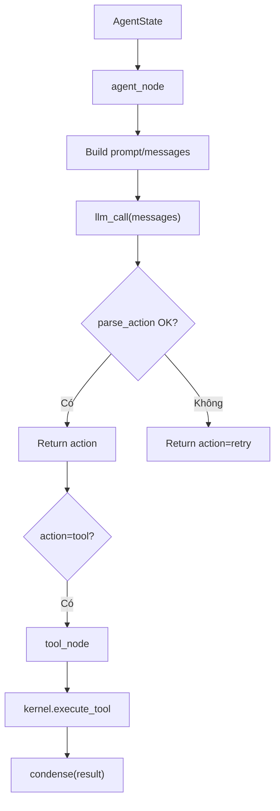

# Giải thích `graph/nodes.py`

File `graph/nodes.py` định nghĩa hai node logic của single-agent graph:

- `agent_node`: gọi LLM và parse action JSON.
- `tool_node`: gọi tool qua kernel và condense kết quả.

Nói ngắn gọn: `nodes.py` là nơi tách hai vai trong vòng agent: suy nghĩ/chọn action và thực thi tool.

## `SYSTEM_PROMPT`

```python
SYSTEM_PROMPT = (
    "You are a tool-using agent. Respond with exactly ONE JSON object, no markdown, no prose:\n"
    '  {"action": "tool", "tool": "<name>", "args": {...}}  to call a tool, or\n'
    '  {"action": "final", "message": "<answer>"}  to finish.\n'
    "Use only tools that exist. After enough evidence, return a final answer."
)
```

Prompt này ép LLM trả đúng một JSON object.

Hai action hợp lệ:

- `{"action": "tool", "tool": "...", "args": {...}}`
- `{"action": "final", "message": "..."}`

Đây là hợp đồng giữa LLM output và `discipline.parse_action()`.

## `agent_node`

```python
def agent_node(state: AgentState, *, llm_call: Callable[..., str], model: str | None = None) -> dict[str, Any]:
```

Node này:

1. build messages cho LLM,
2. gọi `llm_call`,
3. parse output bằng JSON gate,
4. nếu parse lỗi thì trả action `retry`.

### Build messages

```python
messages = [{"role": "system", "content": SYSTEM_PROMPT}, {"role": "user", "content": state.task}]
messages += state.messages
```

Messages gồm:

- system prompt,
- task gốc,
- lịch sử observations/retry messages trong state.

### Gọi LLM

```python
raw = llm_call(messages, model=model)
```

`llm_call` được inject từ ngoài. Trong production có thể là `llm.call_llm`; trong test là scripted fake LLM.

### Parse action

```python
try:
    return parse_action(raw)
except JsonGateError as exc:
    return {"action": "retry", "error": str(exc), "retry_message": build_retry_message(exc)}
```

Nếu output hợp lệ, trả action dict.

Nếu output không parse được hoặc thiếu `action`, trả action đặc biệt:

```python
{"action": "retry", ...}
```

Runtime sẽ dùng retry action để gửi message yêu cầu LLM trả JSON hợp lệ.

## `tool_node`

```python
def tool_node(action: dict[str, Any], *, kernel: AgentKernel) -> Any:
```

Node này thực thi action tool qua kernel.

### Lấy tên tool và args

```python
name = str(action.get("tool", ""))
args = action.get("args") or {}
```

Nếu thiếu tool, tên sẽ thành string rỗng. Kernel/registry sẽ xử lý như missing capability.

### Execute qua kernel

```python
result = kernel.execute_tool(name, args if isinstance(args, dict) else {})
```

Tool chỉ nhận args dạng dict. Nếu `args` không phải dict, truyền dict rỗng để giữ boundary an toàn.

### Condense kết quả

```python
return condense(result)
```

Kết quả tool được rút gọn trước khi feed lại LLM.

## Luồng nodes



## Ý nghĩa thiết kế

`nodes.py` giữ node thuần, nhỏ và dễ test. Node không tự quản lý loop, budget hay logging; các phần đó nằm trong `graph/runtime.py`.

## Quan hệ với file khác

- `graph/runtime.py`: gọi `agent_node` và `tool_node`.
- `discipline/json_gate.py`: parse action và build retry message.
- `discipline/condense.py`: rút gọn tool result.
- `core/kernel.py`: execute tool qua registry.

## Tóm tắt

`graph/nodes.py` chứa hai node cốt lõi của agent graph: một node gọi LLM để lấy action, một node gọi kernel để thực thi tool và trả observation gọn.
