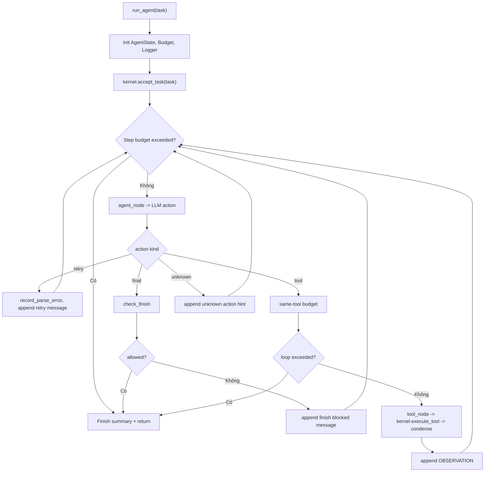

# Giải thích `graph/runtime.py`

File `graph/runtime.py` triển khai vòng single-agent graph: agent node gọi LLM, tool node execute qua kernel, rồi observation được đưa lại cho LLM cho đến khi final hoặc bị budget/gate chặn.

Nói ngắn gọn: `runtime.py` là agent loop thật đầu tiên của project.

## Vai trò trong architecture

Trước module này, project đã có các mảnh rời:

- kernel execute tool,
- LLM adapter,
- JSON gate,
- budget,
- finish gate,
- condense,
- observability.

`run_agent()` nối các mảnh đó thành vòng chạy:

```text
task -> LLM action -> retry/final/tool -> observation -> LLM ...
```

## Function `run_agent`

```python
def run_agent(
    task: str,
    *,
    kernel: AgentKernel,
    llm_call: Callable[..., str],
    model: str | None = None,
    max_steps: int = 12,
    logger: EventLogger | None = None,
) -> dict[str, Any]:
```

Input:

- `task`: yêu cầu user.
- `kernel`: kernel đã nạp feature/tool.
- `llm_call`: hàm gọi LLM, được inject để test offline.
- `model`: model override tùy chọn.
- `max_steps`: giới hạn step.
- `logger`: logger tùy chọn; nếu không truyền, runtime tự tạo.

Output:

```python
{"final": state.final, "steps": state.step, "run_id": summary["run_id"]}
```

## Khởi tạo state/logger/budget

```python
state = AgentState(task=task)
if logger is None:
    logger = EventLogger()
    attach_to_bus(logger, kernel.events)
budget = Budget(max_steps=max_steps)
kernel.accept_task(task)
```

Runtime tạo state, logger, budget và thông báo kernel nhận task.

Nếu caller không truyền logger, runtime tự tạo `EventLogger` và attach vào `kernel.events`.

## Check step budget

```python
if budget.step_exceeded():
    state.final = state.final or "Stopped: step budget exceeded."
    logger.emit("StateEvent", status="budget_exceeded", step=state.step)
    break
```

Mỗi vòng lặp kiểm tra budget trước. Nếu vượt, runtime set final message và dừng.

## Ghi nhận step và gọi agent node

```python
budget.record_step()
logger.count("steps")
state.step += 1

action = agent_node(state, llm_call=llm_call, model=model)
logger.count("llm_calls")
kind = action.get("action")
logger.emit("MessageEvent", role="assistant", step=state.step, action=kind)
```

Mỗi step:

- tăng budget,
- tăng metrics,
- tăng `state.step`,
- gọi LLM qua `agent_node`,
- emit message event.

## Nhánh `retry`

```python
if kind == "retry":
    budget.record_parse_error()
    logger.count("parse_errors")
    if budget.parse_exceeded():
        state.final = "Stopped: too many invalid JSON responses."
        logger.emit("StateEvent", status="parse_budget_exceeded")
        break
    state.messages.append({"role": "user", "content": action.get("retry_message", "Return valid JSON.")})
    continue
```

Nếu LLM output không parse được:

- tăng parse error budget,
- nếu quá giới hạn thì dừng,
- nếu chưa quá thì append retry message vào state để vòng sau nhắc model trả JSON hợp lệ.

## Nhánh `final`

```python
if kind == "final":
    gate = check_finish(
        {"code_changed": state.code_changed, "validation_passed": state.validation_passed},
        action.get("finish_reason"),
    )
```

Trước khi nhận final, runtime chạy finish gate.

Nếu gate block:

```python
logger.count("finish_gate_blocks")
logger.emit("StateEvent", status="finish_gate_blocked", reason=gate["reason"])
state.messages.append({"role": "user", "content": "Finish blocked: " + gate["reason"]})
continue
```

Agent chưa được kết thúc; runtime append message giải thích và quay lại LLM.

Nếu gate cho phép:

```python
state.final = str(action.get("message", ""))
logger.emit("ActionEvent", action="final", step=state.step)
break
```

Runtime lưu final message và dừng.

## Nhánh `tool`

```python
if kind == "tool":
    key = Budget.tool_key(str(action.get("tool", "")), action.get("args") or {})
    budget.record_tool_call(key)
    logger.emit("ActionEvent", action="tool", tool=action.get("tool"), step=state.step)
```

Tạo key cho tool call và ghi nhận để phát hiện lặp cùng tool/args.

Nếu lặp quá nhiều:

```python
if budget.same_tool_exceeded(key):
    state.final = "Stopped: repeated the same tool call too many times."
    logger.emit("StateEvent", status="tool_loop", tool=action.get("tool"))
    break
```

Nếu ổn, execute tool:

```python
observation = tool_node(action, kernel=kernel)
logger.count("condensed")
state.messages.append({"role": "user", "content": "OBSERVATION: " + json.dumps(observation, ensure_ascii=False)})
continue
```

Observation được serialize thành JSON string và append vào messages để LLM thấy kết quả ở bước sau.

## Nhánh action lạ

```python
state.messages.append({"role": "user", "content": "Unknown action; use action=tool or action=final."})
```

Nếu action không phải `retry`, `final`, hay `tool`, runtime không dừng ngay. Nó nhắc LLM dùng action hợp lệ.

## Kết thúc

```python
summary = logger.finish("completed" if state.final else "incomplete", steps=state.step)
return {"final": state.final, "steps": state.step, "run_id": summary["run_id"]}
```

Logger ghi summary. Runtime trả final, số step và run id.

## Luồng tổng quát



## Ý nghĩa thiết kế

`runtime.py` đặt orchestration vào graph layer thay vì kernel. Kernel vẫn chỉ là tool execution substrate. Điều này giúp single-agent hôm nay và multi-agent sau này có thể tái dùng cùng node/loop discipline.

## Quan hệ với file khác

- `graph/nodes.py`: cung cấp `agent_node`, `tool_node`.
- `graph/state.py`: cung cấp `AgentState`.
- `core/kernel.py`: execute tool và publish event.
- `discipline`: budget, JSON gate, finish gate, condense.
- `observability`: event logger và metrics.
- `tests/test_graph.py`: kiểm tra tool->final, retry JSON, và fs tools.

## Tóm tắt

`graph/runtime.py` là vòng agent đơn hoàn chỉnh: gọi LLM, xử lý retry/final/tool, enforce budget/finish gate, ghi observability và trả kết quả cuối.
