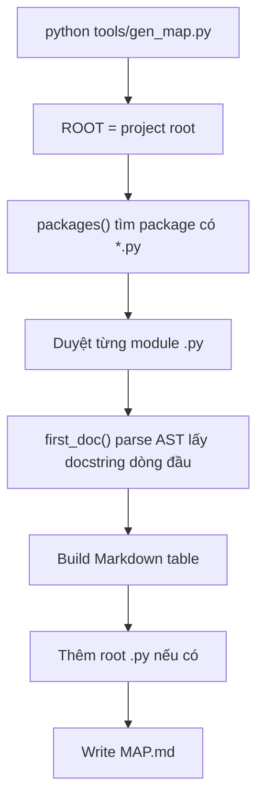

# Giải thích `tools/gen_map.py`

File `tools/gen_map.py` là script tooling dùng để tự sinh `MAP.md` từ docstring dòng đầu của các module Python trong project.

Nói ngắn gọn: `gen_map.py` tạo bản đồ module tự động cho repo.

## Vai trò trong architecture tài liệu

Khi repo lớn dần, người đọc cần một file tổng quan cho biết:

- package nào đang có,
- module nào trong package đó,
- mỗi module làm gì,
- module thuộc epic nào.

Thay vì cập nhật tay `MAP.md`, script này đọc docstring đầu mỗi module rồi sinh bảng Markdown.

Theo `../getting-started.md`, convention là module mới nên có docstring dòng đầu dạng:

```python
"""<mục đích 1 dòng>. Epic Exx."""
```

Script này dùng chính dòng đó để điền vào map.

## Docstring đầu file

```python
"""Regenerate MAP.md from each module's first docstring line. Run: python tools/gen_map.py. Epic: tooling."""
```

Docstring nói rõ:

- script regenerate `MAP.md`,
- nguồn dữ liệu là docstring dòng đầu mỗi module,
- cách chạy là `python tools/gen_map.py`,
- thuộc nhóm tooling.

## Các import

```python
from __future__ import annotations
import ast
from pathlib import Path
```

- `ast`: parse Python source và lấy module docstring an toàn.
- `Path`: xử lý đường dẫn project.

## Hằng số `ROOT`

```python
ROOT = Path(__file__).resolve().parent.parent
```

Xác định thư mục gốc project.

Vì file nằm ở:

```text
tools/gen_map.py
```

nên `.parent` là `tools/`, `.parent.parent` là project root.

## Hằng số `DENY`

```python
DENY = {"tests", "var", "tools", ".git", "__pycache__", ".venv", ".ruff_cache", ".pytest_cache", ".egg-info"}
```

Danh sách package/folder không đưa vào `MAP.md`.

Ý nghĩa từng nhóm:

- `tests`: test không phải module runtime chính.
- `var`: run log/generated data.
- `tools`: tooling không tự đưa chính nó vào map package.
- `.git`, cache, venv: thư mục kỹ thuật/generated.
- `.egg-info`: metadata packaging.

Lưu ý: root `.py` vẫn được đưa vào phần `(root)` nếu có.

## Function `first_doc`

```python
def first_doc(path: Path) -> str:
```

Đọc docstring đầu tiên của một Python file.

### Parse source bằng AST

```python
try:
    doc = ast.get_docstring(ast.parse(path.read_text(encoding="utf-8")))
except Exception as exc:  # pragma: no cover
    return f"(parse error: {exc})"
```

Script đọc file UTF-8, parse bằng `ast.parse`, rồi lấy module docstring bằng `ast.get_docstring`.

Nếu parse lỗi, trả message lỗi thay vì crash.

`# pragma: no cover` cho biết nhánh này không cần coverage test.

### Lấy dòng đầu docstring

```python
return doc.splitlines()[0].strip() if doc else "(thiếu module docstring - thêm 1 dòng + epic)"
```

Nếu module có docstring, lấy dòng đầu.

Nếu không có, trả message nhắc thêm docstring.

Ý nghĩa: `MAP.md` sẽ chỉ chứa mô tả một dòng, không kéo toàn bộ docstring dài.

## Function `packages`

```python
def packages() -> list[str]:
```

Tìm các package runtime cần đưa vào `MAP.md`.

```python
return [
    p.name
    for p in sorted(ROOT.iterdir())
    if p.is_dir() and p.name not in DENY and not p.name.endswith(".egg-info") and any(p.glob("*.py"))
]
```

Một folder được xem là package cần map khi:

- là directory,
- không nằm trong deny-list,
- không kết thúc bằng `.egg-info`,
- có ít nhất một file `.py` trực tiếp bên trong.

Với repo hiện tại, các package runtime như `core`, `discipline`, `features`, `llm`, `observability` sẽ được phát hiện.

`config/` không có `.py`, nên không vào map theo logic này.

## Function `main`

```python
def main() -> int:
```

Entry point chính của script.

### Tạo header cho MAP

```python
lines = [
    "# MAP - chỉ mục module (TỰ SINH bởi `tools/gen_map.py`)",
    "",
    "Mỗi module + một dòng mục đích + epic. **Chạy lại `python tools/gen_map.py`** sau khi thêm/đổi file.",
    "",
]
```

`lines` là list dòng Markdown sẽ được ghi vào `MAP.md`.

Header nói rõ file được tự sinh và không nên sửa tay.

### Sinh bảng cho từng package

```python
for pkg in packages():
    lines += [f"## {pkg}/", "", "| module | mục đích |", "|---|---|"]
    for f in sorted((ROOT / pkg).glob("*.py")):
        if f.name == "__init__.py":
            continue
        lines.append(f"| `{pkg}/{f.name}` | {first_doc(f)} |")
    lines.append("")
```

Với mỗi package:

1. tạo heading `## package/`,
2. tạo bảng Markdown,
3. duyệt các file `.py`,
4. bỏ qua `__init__.py`,
5. thêm dòng module + docstring đầu.

Ví dụ output:

```markdown
## core/

| module | mục đích |
|---|---|
| `core/kernel.py` | ... |
```

## Sinh bảng cho file Python ở root

```python
root_py = sorted(ROOT.glob("*.py"))
if root_py:
    lines += ["## (root)", "", "| file | mục đích |", "|---|---|"]
    for f in root_py:
        lines.append(f"| `{f.name}` | {first_doc(f)} |")
    lines.append("")
```

Nếu project root có file `.py`, script thêm phần `(root)`.

Hiện có `run_smoke.py`, nên nó sẽ xuất hiện ở phần này.

## Ghi `MAP.md`

```python
(ROOT / "MAP.md").write_text("\n".join(lines) + "\n", encoding="utf-8")
print("wrote", ROOT / "MAP.md")
return 0
```

Ghi toàn bộ nội dung vào `MAP.md` bằng UTF-8, in path đã ghi, và trả exit code `0`.

## Entrypoint

```python
if __name__ == "__main__":
    raise SystemExit(main())
```

Cho phép chạy trực tiếp:

```bash
python tools/gen_map.py
```

## Luồng chạy



## Ý nghĩa thiết kế

### 1. Documentation từ source of truth

Docstring đầu module là nguồn dữ liệu. `MAP.md` chỉ là artifact sinh ra.

### 2. Ít thao tác tay

Khi thêm module, chỉ cần thêm docstring rồi chạy script.

### 3. Không đưa generated/test/tool vào map runtime

`DENY` giúp map tập trung vào module runtime chính.

### 4. Parse bằng AST thay vì regex

AST lấy module docstring chính xác hơn so với tự parse text bằng regex.

## Quan hệ với file khác

- `../getting-started.md`: mô tả convention dùng script này.
- `MAP.md`: output được script sinh ra.
- Các module `.py`: cần docstring dòng đầu để map có mô tả tốt.

## Tóm tắt một câu

`tools/gen_map.py` là script tự sinh `MAP.md` bằng cách đọc docstring dòng đầu của các module Python runtime, giúp repo có bản đồ module luôn cập nhật.
