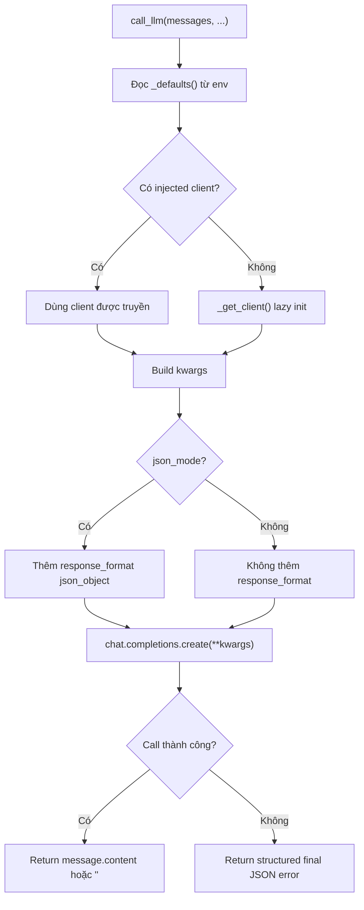

# Giải thích `llm/adapter.py`

File `llm/adapter.py` định nghĩa adapter gọi LLM theo chuẩn OpenAI-compatible chat completions. Adapter này có ba đặc điểm chính: lazy client, JSON mode mặc định, và cho phép inject client để test offline.

Nói ngắn gọn: `adapter.py` là lớp giao tiếp với LLM, nhưng được thiết kế để không làm network/client khởi tạo khi chỉ import module.

## Vai trò trong architecture

Project tách LLM ra khỏi kernel. Kernel hiện không gọi LLM trực tiếp. Khi agent loop hoàn chỉnh được xây, loop đó có thể gọi `call_llm()`, parse output bằng `discipline.parse_action()`, rồi gọi `kernel.execute_tool()`.

Adapter này thuộc Epic E03, tức lớp LLM adapter.

## Docstring đầu file

```python
"""OpenAI-compatible LLM adapter - JSON-mode, lazy client, injectable for tests. Epic E03."""
```

Docstring tóm tắt các quyết định thiết kế:

- OpenAI-compatible API,
- JSON-mode,
- lazy client,
- injectable cho test,
- thuộc E03.

## Các import

```python
from __future__ import annotations
```

Bật postponed evaluation cho type annotations.

```python
import json
import os
from typing import Any
```

- `json`: dùng để trả về JSON string có cấu trúc khi LLM call lỗi.
- `os`: đọc biến môi trường cấu hình LLM.
- `Any`: dùng vì client OpenAI/fake client không có type cụ thể trong module này.

## Biến module `_client`

```python
_client: Any = None
```

Đây là cache client ở cấp module.

Ban đầu là `None`. Client thật chỉ được tạo khi có call LLM đầu tiên mà caller không inject client.

Comment trong code:

```python
# Lazy module-level client cache. Importing this module does NOT build a client
# and does NOT import the openai package - that happens on first real call.
```

Ý nghĩa:

- import `llm.adapter` không import package `openai`,
- import module không mở connection,
- test có thể import module mà không cần LLM server,
- startup nhẹ hơn.

## Function `_defaults`

```python
def _defaults() -> dict[str, Any]:
```

Function này đọc config LLM từ environment variables và trả về dict mặc định.

```python
return {
    "base_url": os.getenv("LLM_BASE_URL", "http://localhost:1234/v1"),
    "api_key": os.getenv("LLM_API_KEY", "lm-studio"),
    "model": os.getenv("LLM_MODEL", "local-model"),
    "max_tokens": int(os.getenv("LLM_MAX_TOKENS", "2048")),
    "timeout": float(os.getenv("LLM_TIMEOUT", "600")),
}
```

Các biến môi trường:

- `LLM_BASE_URL`: endpoint OpenAI-compatible, mặc định `http://localhost:1234/v1`.
- `LLM_API_KEY`: API key, mặc định `"lm-studio"`.
- `LLM_MODEL`: tên model, mặc định `"local-model"`.
- `LLM_MAX_TOKENS`: max tokens, mặc định `2048`.
- `LLM_TIMEOUT`: timeout giây, mặc định `600`.

Mặc định này gợi ý project ưu tiên local OpenAI-compatible server như LM Studio.

## Function `_get_client`

```python
def _get_client() -> Any:
```

Function này trả về OpenAI client, tạo mới nếu chưa có.

### Dùng global cache

```python
global _client
if _client is None:
```

`global _client` cho phép function gán lại biến module `_client`.

Nếu `_client` chưa được tạo, mới khởi tạo.

### Lazy import OpenAI

```python
from openai import OpenAI  # lazy import
```

Package `openai` chỉ được import khi cần client thật.

Điều này là cốt lõi của lazy-init.

### Tạo client

```python
cfg = _defaults()
_client = OpenAI(base_url=cfg["base_url"], api_key=cfg["api_key"], timeout=cfg["timeout"])
```

Client được tạo từ config environment.

Lưu ý: model và max_tokens không nằm trong client, chúng được dùng khi gọi completion.

### Trả client

```python
return _client
```

Những call sau sẽ dùng lại client đã cache.

## Function `reset_client`

```python
def reset_client() -> None:
    global _client
    _client = None
```

Reset cache client về `None`.

Ý nghĩa:

- test có thể đảm bảo trạng thái sạch,
- nếu config environment đổi, có thể reset để lần sau tạo client mới,
- tránh state leak giữa test.

Test `test_module_import_is_lazy` dùng function này để assert `_client is None`.

## Function `call_llm`

```python
def call_llm(
    messages: list[dict[str, str]],
    *,
    model: str | None = None,
    temperature: float = 0.2,
    json_mode: bool = True,
    client: Any = None,
) -> str:
```

Đây là API chính của adapter.

Input:

- `messages`: list chat messages theo format OpenAI.
- `model`: override model nếu muốn.
- `temperature`: sampling temperature, mặc định `0.2`.
- `json_mode`: nếu `True`, yêu cầu response JSON object.
- `client`: client inject tùy chọn, chủ yếu dùng cho test.

Output:

- string content từ response của model,
- hoặc JSON string dạng `final` nếu request lỗi.

## Docstring của `call_llm`

```python
"""
Call an OpenAI-compatible chat endpoint.

- `json_mode=True` sets response_format=json_object so the model returns JSON.
- `client` can be injected (for tests); otherwise a lazy module client is used.
- On error, returns a structured `final` JSON string (never raises into the loop).
"""
```

Ba điểm quan trọng:

1. gọi endpoint OpenAI-compatible,
2. JSON mode mặc định,
3. lỗi được biến thành JSON action thay vì raise.

## Bước 1: đọc default config

```python
cfg = _defaults()
```

Mỗi lần gọi đọc lại environment defaults.

Điều này cho phép các giá trị như `LLM_MODEL` hoặc `LLM_MAX_TOKENS` được lấy tại thời điểm call.

## Bước 2: chọn client

```python
active = client if client is not None else _get_client()
```

Nếu caller truyền client, dùng client đó.

Nếu không, dùng lazy module client.

Ý nghĩa test:

```python
fake = _FakeClient()
call_llm(messages, client=fake)
```

Không cần import/tạo OpenAI client thật, không cần network.

## Bước 3: tạo kwargs cho chat completions

```python
kwargs: dict[str, Any] = {
    "model": model or cfg["model"],
    "messages": messages,
    "temperature": temperature,
    "max_tokens": cfg["max_tokens"],
}
```

Các tham số gửi cho:

```python
active.chat.completions.create(**kwargs)
```

Nếu caller truyền `model`, dùng model đó. Nếu không, dùng `LLM_MODEL` hoặc default.

## Bước 4: bật JSON mode nếu cần

```python
if json_mode:
    kwargs["response_format"] = {"type": "json_object"}
```

Khi `json_mode=True`, adapter yêu cầu model trả JSON object.

Đây là hợp đồng quan trọng với `discipline/json_gate.py`, vì agent loop kỳ vọng output là một JSON action object.

Nếu `json_mode=False`, key `response_format` không được gửi.

## Bước 5: gọi LLM

```python
try:
    response = active.chat.completions.create(**kwargs)
    return response.choices[0].message.content or ""
```

Adapter gọi chat completions API.

Nó lấy content từ choice đầu tiên:

```python
response.choices[0].message.content
```

Nếu content là `None` hoặc falsy, trả string rỗng.

## Bước 6: lỗi trả về structured final JSON

```python
except Exception as exc:
    return json.dumps(
        {"action": "final", "finish_reason": "error", "message": f"LLM request failed: {exc}"},
        ensure_ascii=False,
    )
```

Nếu request lỗi, function không raise exception ra ngoài.

Thay vào đó trả string JSON:

```json
{"action": "final", "finish_reason": "error", "message": "LLM request failed: ..."}
```

Ý nghĩa: agent loop sau này có thể parse output bằng `parse_action()` và đi vào nhánh final/error một cách có kiểm soát.

`ensure_ascii=False` giữ Unicode readable nếu message có ký tự không phải ASCII.

## Luồng gọi LLM



## Ý nghĩa thiết kế

### 1. Lazy client giúp import an toàn

Import module không cần package `openai` được load ngay và không tạo client sớm.

### 2. Injectable client giúp test offline

Test có thể truyền fake client và kiểm tra kwargs mà không gọi network.

### 3. JSON mode nằm ở LLM layer

Agent loop không cần nhớ set `response_format`; adapter làm mặc định.

### 4. Lỗi LLM không phá loop

Lỗi được biến thành JSON action `final` với `finish_reason="error"`.

## Quan hệ với file khác

- `llm/__init__.py`: export `call_llm` và `reset_client`.
- `discipline/json_gate.py`: parse string output từ LLM thành action object.
- `tests/test_llm_adapter.py`: kiểm tra lazy import, injected client, JSON mode và error fallback.

## Tóm tắt một câu

`llm/adapter.py` cung cấp hàm `call_llm()` để gọi OpenAI-compatible chat API theo JSON mode, lazy-init client, test được bằng fake client, và luôn trả string có thể xử lý thay vì ném lỗi ra agent loop.
