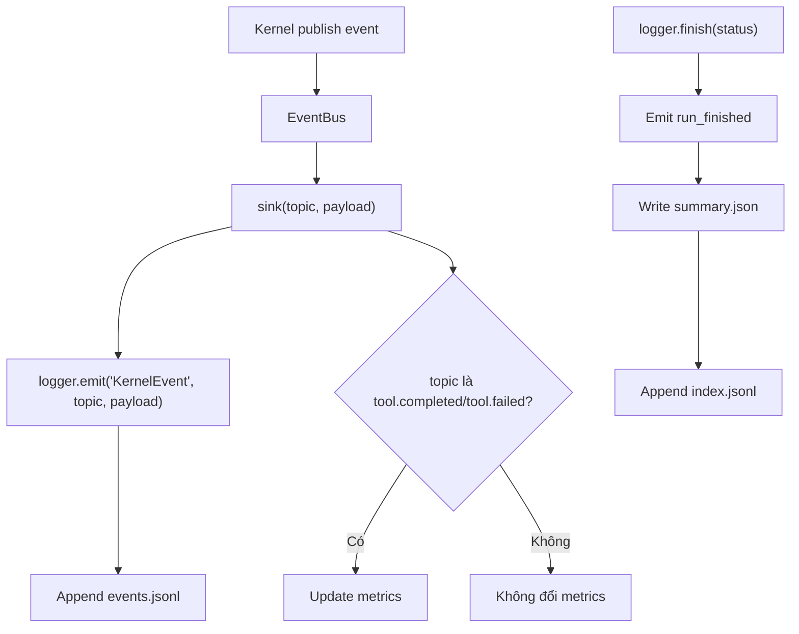

# Giải thích `observability/event_log.py`

File `observability/event_log.py` định nghĩa hệ thống ghi event log cho agent runtime. Nó tạo thư mục run, ghi event theo JSONL, giữ metrics đơn giản, ghi `summary.json`, và có helper để subscribe vào `EventBus` của kernel.

Nói ngắn gọn: `event_log.py` biến các sự kiện runtime thành log có thể inspect sau.

## Vai trò trong architecture

Kernel chỉ publish event qua `EventBus`. Nó không biết log ghi đi đâu.

`EventLogger` là observer bên ngoài:

1. subscribe vào event bus,
2. nhận event kernel,
3. ghi ra `events.jsonl`,
4. cập nhật metrics,
5. ghi summary khi run kết thúc.

Điều này giữ observability tách khỏi kernel.

## Docstring đầu file

```python
"""EventLogger - JSONL event log + summary.json + metrics; subscribes to the EventBus. Epic E04."""
```

Module này thuộc Epic E04, phụ trách observability.

## Các import

```python
from __future__ import annotations
```

Bật postponed evaluation cho type annotations.

```python
import json
import os
import uuid
from datetime import datetime, timezone
from pathlib import Path
from typing import Any
```

- `json`: serialize event và summary.
- `os`: đọc env var cấu hình logging.
- `uuid`: tạo suffix run id.
- `datetime`, `timezone`: timestamp UTC.
- `Path`: thao tác đường dẫn.
- `Any`: payload event linh hoạt.

```python
from core.events import EventBus
```

`attach_to_bus()` nhận `EventBus` để subscribe logger.

## Hằng số `PROJECT_DIR`

```python
PROJECT_DIR = Path(__file__).resolve().parent.parent
```

Xác định thư mục gốc project từ vị trí file.

Vì file nằm ở:

```text
observability/event_log.py
```

`.parent` là `observability/`, `.parent.parent` là project root.

## Hằng số `_METRICS`

```python
_METRICS = (
    "steps",
    "llm_calls",
    "tool_calls",
    "tool_failures",
    "parse_errors",
    "policy_blocks",
    "finish_gate_blocks",
    "condensed",
)
```

Đây là danh sách metrics chuẩn mà logger theo dõi.

Hiện tại `attach_to_bus()` tự tăng:

- `tool_calls`,
- `tool_failures`.

Các metric khác được chuẩn bị cho agent loop sau này:

- `steps`,
- `llm_calls`,
- `parse_errors`,
- `policy_blocks`,
- `finish_gate_blocks`,
- `condensed`.

## Function `runs_dir`

```python
def runs_dir() -> Path:
    return Path(os.getenv("AGENT_RUNS_DIR", str(PROJECT_DIR / "var" / "agent_runs")))
```

Trả về thư mục lưu run log.

Nếu env var `AGENT_RUNS_DIR` tồn tại, dùng nó.

Nếu không, dùng mặc định:

```text
var/agent_runs
```

Ý nghĩa:

- production/dev dùng default,
- test có thể set `AGENT_RUNS_DIR` vào temp dir,
- không hard-code path trong test.

## Function `_now`

```python
def _now() -> str:
    return datetime.now(timezone.utc).isoformat()
```

Trả timestamp hiện tại theo UTC ở dạng ISO string.

Ví dụ:

```text
2026-06-16T06:02:59.123456+00:00
```

Tên bắt đầu bằng `_` vì đây là helper nội bộ.

## Class `EventLogger`

```python
class EventLogger:
```

`EventLogger` quản lý một run log.

Một instance tương ứng với một run id và một thư mục:

```text
var/agent_runs/<run_id>/
```

Trong đó có thể có:

```text
events.jsonl
summary.json
```

## Constructor `__init__`

```python
def __init__(self, run_id: str | None = None, *, enabled: bool | None = None) -> None:
```

Input:

- `run_id`: id run tùy chọn. Nếu không truyền, tự sinh.
- `enabled`: bật/tắt ghi file. Nếu `None`, đọc env `AGENT_EVENT_LOG`.

### Xác định logging enabled

```python
self.enabled = (os.getenv("AGENT_EVENT_LOG", "1") != "0") if enabled is None else enabled
```

Nếu caller truyền `enabled`, dùng giá trị đó.

Nếu không, đọc env:

- `AGENT_EVENT_LOG=0`: tắt ghi file,
- mặc định: bật.

### Tạo run id

```python
self.run_id = run_id or (datetime.now().strftime("%Y%m%d_%H%M%S_") + uuid.uuid4().hex[:8])
```

Nếu caller không truyền run id, logger tự tạo dạng:

```text
20260616_100259_f73860fe
```

Gồm timestamp local format và 8 ký tự UUID.

### Khởi tạo sequence

```python
self.seq = 0
```

Mỗi event sẽ tăng `sequence` lên 1.

Sequence giúp đọc event theo thứ tự ghi.

### Khởi tạo metrics

```python
self.metrics: dict[str, int] = {k: 0 for k in _METRICS}
```

Tạo dict metric, tất cả bắt đầu từ 0.

### Xác định path

```python
self.run_dir = runs_dir() / self.run_id
self.events_path = self.run_dir / "events.jsonl"
```

Mỗi run có thư mục riêng.

File event chính là:

```text
events.jsonl
```

### Tạo thư mục nếu enabled

```python
if self.enabled:
    self.run_dir.mkdir(parents=True, exist_ok=True)
```

Nếu logging bật, tạo thư mục run.

Nếu logging tắt, không tạo gì.

### Emit `run_started`

```python
self.emit("StateEvent", status="run_started")
```

Ngay khi tạo logger, nó ghi event bắt đầu run.

Nếu `enabled=False`, event vẫn được tạo và return từ `emit`, nhưng không ghi ra file.

## Method `emit`

```python
def emit(self, kind: str, **fields: Any) -> dict[str, Any]:
```

Ghi một event.

Input:

- `kind`: loại event, ví dụ `"StateEvent"`, `"KernelEvent"`, `"ActionEvent"`.
- `**fields`: các field bổ sung.

### Tăng sequence

```python
self.seq += 1
```

Mỗi event có số thứ tự tăng dần.

### Tạo event object

```python
event = {"sequence": self.seq, "timestamp": _now(), "run_id": self.run_id, "kind": kind, **fields}
```

Event luôn có:

- `sequence`,
- `timestamp`,
- `run_id`,
- `kind`.

Sau đó merge thêm các field tùy ý.

Ví dụ:

```python
logger.emit("ActionEvent", action="tool", tool="echo")
```

tạo event có thêm `action` và `tool`.

### Ghi JSONL nếu enabled

```python
if self.enabled:
    with self.events_path.open("a", encoding="utf-8") as handle:
        handle.write(json.dumps(event, ensure_ascii=False) + "\n")
```

Mỗi event được ghi thành một dòng JSON.

JSONL phù hợp cho event log vì:

- append đơn giản,
- đọc từng dòng dễ,
- không cần giữ toàn bộ file là JSON array hợp lệ trong lúc đang chạy.

`ensure_ascii=False` giữ Unicode readable.

### Return event

```python
return event
```

Kể cả khi logging disabled, caller vẫn nhận event object.

## Method `count`

```python
def count(self, metric: str, n: int = 1) -> None:
    if metric in self.metrics:
        self.metrics[metric] += n
```

Tăng metric.

Input:

- `metric`: tên metric.
- `n`: số lượng tăng, mặc định 1.

Nếu metric không nằm trong `_METRICS`, function bỏ qua.

Ý nghĩa: metrics có whitelist, tránh vô tình thêm key linh tinh.

## Method `finish`

```python
def finish(self, status: str = "completed", **extra: Any) -> dict[str, Any]:
```

Kết thúc run và ghi summary.

### Emit event kết thúc

```python
self.emit("StateEvent", status="run_finished", result_status=status)
```

Ghi event cho biết run đã kết thúc.

### Tạo summary

```python
summary = {"run_id": self.run_id, "status": status, "metrics": dict(self.metrics), **extra}
```

Summary gồm:

- `run_id`,
- `status`,
- `metrics`,
- các field extra nếu caller truyền.

### Ghi `summary.json`

```python
if self.enabled:
    (self.run_dir / "summary.json").write_text(
        json.dumps(summary, ensure_ascii=False, indent=2), encoding="utf-8"
    )
```

Ghi summary readable với indent 2.

### Append vào `index.jsonl`

```python
with (runs_dir() / "index.jsonl").open("a", encoding="utf-8") as handle:
    handle.write(json.dumps({"run_id": self.run_id, "status": status}, ensure_ascii=False) + "\n")
```

Index lưu danh sách run ngắn gọn.

Mỗi dòng chứa:

- `run_id`,
- `status`.

### Return summary

```python
return summary
```

Caller có thể dùng summary ngay mà không cần đọc file.

## Function `attach_to_bus`

```python
def attach_to_bus(logger: EventLogger, bus: EventBus) -> None:
    """Mirror kernel events into the event log and update metrics."""
```

Function này nối `EventLogger` với `EventBus`.

Sau khi attach, mọi event kernel publish sẽ được logger ghi lại dưới dạng `KernelEvent`.

## Nested function `sink`

```python
def sink(topic: str, payload: dict[str, Any]) -> None:
```

`sink` là subscriber được đăng ký vào bus.

### Mirror kernel event

```python
logger.emit("KernelEvent", topic=topic, **payload)
```

Mọi event từ kernel được ghi với:

- `kind="KernelEvent"`,
- `topic=<topic gốc>`,
- payload gốc được merge vào event.

### Cập nhật metrics tool

```python
if topic == "tool.completed":
    logger.count("tool_calls")
elif topic == "tool.failed":
    logger.count("tool_calls")
    logger.count("tool_failures")
```

Nếu tool completed, tăng `tool_calls`.

Nếu tool failed, tăng cả:

- `tool_calls`,
- `tool_failures`.

## Subscribe sink vào bus

```python
bus.subscribe(sink)
```

Sau dòng này, logger bắt đầu nhận event từ bus.

## Luồng observability



## Ý nghĩa thiết kế

### 1. Observability từ ngày đầu

Mỗi run có event log và summary. Điều này giúp debug agent dễ hơn khi loop phức tạp lên.

### 2. Kernel không phụ thuộc logger

Logger subscribe vào bus. Kernel không import `EventLogger`.

### 3. JSONL thân thiện với stream

Append event từng dòng đơn giản và ổn định.

### 4. Test dễ

Test set `AGENT_RUNS_DIR` vào temp dir để kiểm tra file output mà không đụng vào `var/`.

## Quan hệ với file khác

- `core/events.py`: cung cấp `EventBus`.
- `core/kernel.py`: publish event vào bus.
- `observability/inspect.py`: đọc `summary.json` và `events.jsonl`.
- `observability/__init__.py`: export `EventLogger`, `attach_to_bus`, `runs_dir`.
- `run_smoke.py`: tạo logger và attach vào kernel event bus.
- `tests/test_observability.py`: kiểm tra ghi event/summary và disabled logging.

## Tóm tắt một câu

`observability/event_log.py` cung cấp event logger JSONL cho agent runtime, tách khỏi kernel qua EventBus, có metrics và summary để inspect lại từng run.
