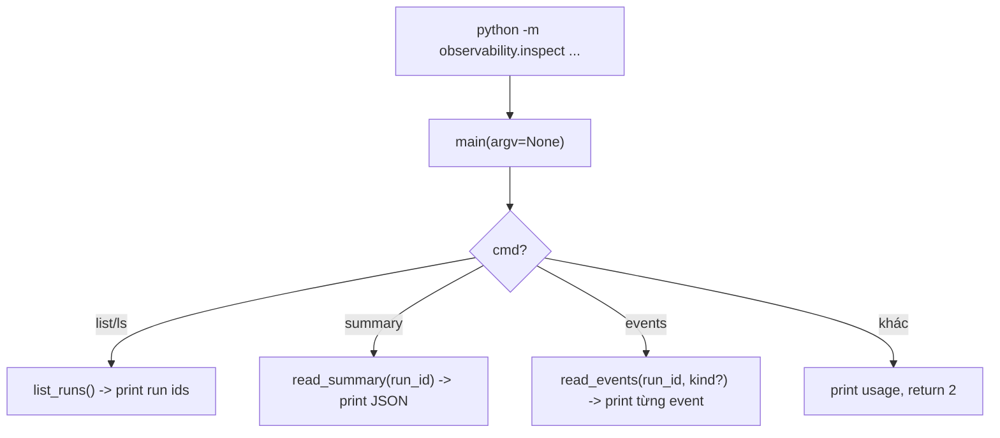

# Giải thích `observability/inspect.py`

File `observability/inspect.py` cung cấp API và CLI để xem lại các run log đã được ghi bởi `EventLogger`. Nó có thể list run, đọc summary, đọc events, và lọc event theo `kind` hoặc `topic`.

Nói ngắn gọn: `inspect.py` là công cụ đọc log sau khi agent chạy.

## Vai trò trong architecture

`event_log.py` ghi dữ liệu.

`inspect.py` đọc dữ liệu đó.

Hai file này tách nhau để:

- runtime logging đơn giản,
- inspection dùng được từ CLI,
- test có thể gọi function đọc summary/events trực tiếp,
- người dùng có thể xem run mới nhất bằng command.

## Docstring đầu file

```python
"""CLI to inspect runs - list / summary / events from the event log. Epic E04."""
```

Module này thuộc Epic E04, phần observability.

## Các import

```python
from __future__ import annotations
```

Bật postponed evaluation cho annotation.

```python
import json
import sys
from pathlib import Path
from typing import Any
```

- `json`: parse/print JSON.
- `sys`: đọc command-line args.
- `Path`: thao tác file path.
- `Any`: type cho dict summary/event.

```python
from observability.event_log import runs_dir
```

`inspect.py` dùng cùng `runs_dir()` với logger để biết log nằm ở đâu.

Nhờ vậy nếu env `AGENT_RUNS_DIR` được set, cả logger và inspector cùng nhìn vào một thư mục.

## Function `_run_dirs`

```python
def _run_dirs() -> list[Path]:
```

Trả danh sách thư mục run, sắp xếp mới nhất trước.

### Lấy base dir

```python
base = runs_dir()
```

Base mặc định là:

```text
var/agent_runs
```

hoặc env `AGENT_RUNS_DIR`.

### Nếu base chưa tồn tại

```python
if not base.exists():
    return []
```

Chưa có run nào thì trả list rỗng.

### Lọc thư mục và sort

```python
return sorted((p for p in base.iterdir() if p.is_dir()), key=lambda p: p.name, reverse=True)
```

Chỉ lấy directory con.

Sort theo tên giảm dần. Vì run id mặc định bắt đầu bằng timestamp dạng `YYYYMMDD_HHMMSS_...`, sort theo tên cũng gần tương đương sort mới nhất trước.

## Function `_resolve`

```python
def _resolve(run_id: str | None) -> Path | None:
```

Chuyển `run_id` thành path thư mục run.

Input có thể là:

- `None`,
- `"latest"`,
- run id cụ thể.

### Lấy danh sách run

```python
dirs = _run_dirs()
if not dirs:
    return None
```

Nếu không có run nào, trả `None`.

### Resolve latest

```python
if run_id in (None, "latest"):
    return dirs[0]
```

Nếu không truyền run id hoặc truyền `"latest"`, lấy run đầu tiên trong list đã sort.

### Tìm run cụ thể

```python
for p in dirs:
    if p.name == run_id:
        return p
return None
```

Nếu tìm thấy thư mục có tên đúng run id, trả path. Nếu không, trả `None`.

## Function `list_runs`

```python
def list_runs() -> list[str]:
    return [p.name for p in _run_dirs()]
```

Trả danh sách run id.

Function này dùng cho CLI command:

```bash
python -m observability.inspect list
```

## Function `read_summary`

```python
def read_summary(run_id: str | None = None) -> dict[str, Any] | None:
```

Đọc file `summary.json` của một run.

Nếu không truyền run id, mặc định đọc latest.

### Resolve run path

```python
run = _resolve(run_id)
if run is None:
    return None
```

Không tìm thấy run thì trả `None`.

### Xác định file summary

```python
summary = run / "summary.json"
if not summary.exists():
    return None
```

Nếu run chưa có summary, trả `None`.

### Parse JSON

```python
return json.loads(summary.read_text(encoding="utf-8"))
```

Đọc UTF-8 và parse JSON thành dict.

## Function `read_events`

```python
def read_events(run_id: str | None = None, *, kind: str | None = None, topic: str | None = None) -> list[dict[str, Any]]:
```

Đọc file `events.jsonl` của một run.

Input:

- `run_id`: run cụ thể hoặc latest.
- `kind`: lọc theo event kind, ví dụ `"KernelEvent"`.
- `topic`: lọc theo topic, ví dụ `"tool.completed"`.

### Resolve run và file path

```python
run = _resolve(run_id)
if run is None:
    return []
path = run / "events.jsonl"
if not path.exists():
    return []
```

Không tìm thấy run hoặc file events thì trả list rỗng.

### Đọc từng dòng JSONL

```python
events: list[dict[str, Any]] = []
for line in path.read_text(encoding="utf-8").splitlines():
    if not line.strip():
        continue
    event = json.loads(line)
```

File JSONL được đọc từng dòng.

Dòng rỗng bị bỏ qua.

### Lọc theo kind

```python
if kind and event.get("kind") != kind:
    continue
```

Nếu caller truyền `kind`, chỉ giữ event có `event["kind"]` tương ứng.

### Lọc theo topic

```python
if topic and event.get("topic") != topic:
    continue
```

Nếu caller truyền `topic`, chỉ giữ event có `event["topic"]` tương ứng.

### Append event

```python
events.append(event)
```

Cuối cùng trả list event đã lọc.

## Function `main`

```python
def main(argv: list[str] | None = None) -> int:
```

Entry point CLI.

Nếu `argv` là `None`, lấy args từ `sys.argv[1:]`.

Nếu truyền `argv`, dùng list đó. Điều này giúp test dễ hơn nếu cần.

### Parse command

```python
args = list(sys.argv[1:] if argv is None else argv)
cmd = args[0] if args else "list"
```

Nếu không có command, mặc định là `list`.

## Command `list` / `ls`

```python
if cmd in {"list", "ls"}:
    for name in list_runs():
        print(name)
    return 0
```

In danh sách run id, mỗi dòng một run.

Exit code `0` nghĩa là thành công.

## Command `summary`

```python
if cmd == "summary":
    run_id = args[1] if len(args) > 1 else "latest"
    summary = read_summary(run_id)
    print(json.dumps(summary, ensure_ascii=False, indent=2) if summary else "No summary found.")
    return 0
```

Đọc summary của run cụ thể hoặc latest.

Ví dụ:

```bash
python -m observability.inspect summary latest
python -m observability.inspect summary 20260616_100259_f73860fe
```

Nếu không có summary, in:

```text
No summary found.
```

## Command `events`

```python
if cmd == "events":
    run_id = args[1] if len(args) > 1 else "latest"
    kind = None
    if "--kind" in args:
        kind = args[args.index("--kind") + 1]
    for event in read_events(run_id, kind=kind):
        print(json.dumps(event, ensure_ascii=False))
    return 0
```

Đọc events của run.

Ví dụ:

```bash
python -m observability.inspect events latest
python -m observability.inspect events latest --kind KernelEvent
```

Hiện CLI hỗ trợ filter `--kind`, nhưng chưa expose filter `topic` trên command line dù function `read_events()` đã hỗ trợ tham số `topic`.

Lưu ý nhỏ: nếu user truyền `--kind` mà không truyền giá trị phía sau, dòng `args[args.index("--kind") + 1]` có thể gây `IndexError`. Với CLI nội bộ tối giản, điều này tạm chấp nhận được.

## Command không hợp lệ

```python
print("usage: inspect [list | summary [run|latest] | events [run|latest] --kind KIND]")
return 2
```

Nếu command không nhận diện được, in usage và trả exit code `2`.

## Entrypoint module

```python
if __name__ == "__main__":
    raise SystemExit(main())
```

Cho phép chạy module trực tiếp:

```bash
python -m observability.inspect list
```

`main()` trả int, `SystemExit` dùng int đó làm process exit code.

## Luồng CLI



## Ý nghĩa thiết kế

### 1. Log có công cụ đọc ngay

Không chỉ ghi log, project có CLI inspect để xem lại nhanh.

### 2. Function API và CLI dùng chung

`list_runs()`, `read_summary()`, `read_events()` dùng được cả trong test và CLI.

### 3. `latest` tiện cho smoke/debug

Sau khi chạy `run_smoke.py`, có thể xem ngay:

```bash
python -m observability.inspect summary latest
```

### 4. Cùng source of truth với logger

Inspector dùng `runs_dir()` từ `event_log.py`, nên không lệch thư mục với logger.

## Quan hệ với file khác

- `observability/event_log.py`: ghi file mà inspector đọc.
- `observability/__init__.py`: không export inspect API, nhưng vẫn có thể import `observability.inspect`.
- `tests/test_observability.py`: gọi `insp.list_runs()`, `insp.read_summary()`, `insp.read_events()`.
- `README.md`: hướng dẫn dùng `python -m observability.inspect ...`.

## Tóm tắt một câu

`observability/inspect.py` là CLI/API đọc lại run logs, giúp list run, xem summary và xem events đã được `EventLogger` ghi ra disk.
