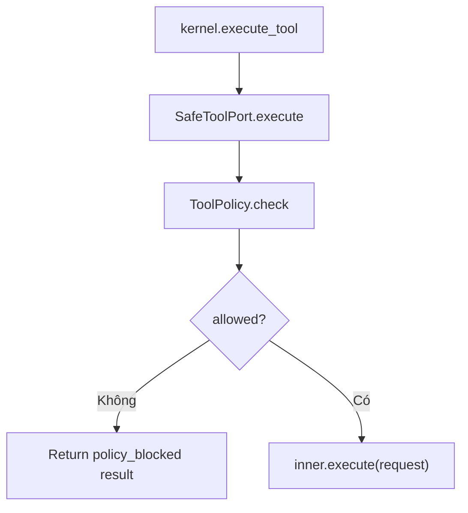

# Giải thích `safety/policy.py`

File `safety/policy.py` định nghĩa safety chokepoint cho tool execution. Nó phân loại terminal argv, chặn shell/control token/destructive command/git mutation, và cung cấp `SafeToolPort` để bọc tool executor.

Nói ngắn gọn: `policy.py` là cổng an toàn trước khi toolbox tool thật được chạy.

## Các tập luật

```python
SHELL_EXES = {"bash", "sh", "zsh", "cmd", "cmd.exe", "powershell", "powershell.exe", "pwsh"}
SHELL_TOKENS = ("|", "&", ";", ">", "<", "`", "$(", "&&", "||")
DESTRUCTIVE_EXES = {"rm", "del", "rmdir", "format", "mkfs", "dd"}
GIT_MUTATIONS = {"add", "commit", "reset", "checkout", "rebase", "push", "merge", "branch", "stash"}
```

Ý nghĩa:

- `SHELL_EXES`: không cho gọi shell trực tiếp.
- `SHELL_TOKENS`: chặn token điều khiển/redirection thường dùng trong shell.
- `DESTRUCTIVE_EXES`: chặn lệnh có rủi ro phá hủy.
- `GIT_MUTATIONS`: các subcommand git làm thay đổi repo.

## `PolicyDecision`

```python
@dataclass(frozen=True)
class PolicyDecision:
    allowed: bool
    reason: str = ""
    code: str = ""
    risk: str = "low"
```

Kết quả policy check.

- `allowed`: có cho phép chạy không.
- `reason`: giải thích nếu bị chặn.
- `code`: mã máy đọc được, ví dụ `shell_exe`, `git_mutation`.
- `risk`: mức rủi ro, hiện dùng `"low"` hoặc `"blocked"`.

## Helper `_truthy`

```python
def _truthy(name: str) -> bool:
    return os.getenv(name, "").strip().lower() in {"1", "true", "yes", "on"}
```

Đọc env var dạng boolean.

Ví dụ `AGENT_ALLOW_GIT_MUTATIONS=1` sẽ được coi là true.

## `classify_terminal`

```python
def classify_terminal(argv: Any) -> PolicyDecision:
```

Kiểm tra argv trước khi cho terminal tool chạy.

### Chặn argv sai

```python
if not isinstance(argv, list) or not argv:
    return PolicyDecision(False, "terminal requires a non-empty argv list", "bad_argv", "blocked")
```

Terminal phải nhận argv list không rỗng.

### Lấy executable

```python
exe = str(argv[0]).replace("\\", "/").split("/")[-1].lower()
```

Lấy tên executable cuối cùng, normalize slash và lowercase.

### Chặn shell executable

```python
if exe in SHELL_EXES:
    return PolicyDecision(False, "shell executables are not allowed; pass argv directly", "shell_exe", "blocked")
```

Không cho chạy `bash -c`, `cmd /c`, PowerShell, v.v.

### Chặn shell token

```python
if any(tok in str(part) for part in argv for tok in SHELL_TOKENS):
    return PolicyDecision(False, "shell control/redirection tokens are not allowed", "shell_token", "blocked")
```

Nếu bất kỳ part nào chứa token shell/redirection, block.

### Chặn destructive executable

```python
if exe in DESTRUCTIVE_EXES:
    return PolicyDecision(False, "destructive command blocked", "destructive", "blocked")
```

Chặn `rm`, `del`, `dd`, v.v.

### Chặn git mutation

```python
if exe in {"git", "git.exe"} and len(argv) >= 2 and str(argv[1]).lower() in GIT_MUTATIONS and not _truthy(
    "AGENT_ALLOW_GIT_MUTATIONS"
):
    return PolicyDecision(False, f"git {argv[1]} blocked (set AGENT_ALLOW_GIT_MUTATIONS=1)", "git_mutation", "blocked")
```

Git mutation bị chặn trừ khi env `AGENT_ALLOW_GIT_MUTATIONS` truthy.

### Cho phép

```python
return PolicyDecision(True, risk="low")
```

Nếu không vi phạm rule nào, command được phép.

## `ToolPolicy`

```python
class ToolPolicy:
    """The single cross-cutting safety gate. Extend here, not per-server."""
```

Policy trung tâm cho tool. Ý tưởng: thêm rule ở đây thay vì rải khắp từng tool.

### `check`

```python
def check(self, tool_name: str, args: dict[str, Any]) -> PolicyDecision:
```

Nếu tool là terminal:

```python
if tool_name in {"terminal_run", "terminal.run", "terminal"}:
    return classify_terminal(args.get("argv"))
```

Nếu tool name gợi ý git mutation:

```python
if any(m in tool_name for m in ("git_commit", "git_add", "git_reset", "git_checkout", "git_push")) ...
```

thì block nếu chưa bật env cho phép.

Tool khác mặc định allowed.

## `SafeToolPort`

```python
class SafeToolPort:
```

Wrapper quanh tool executor.

### Constructor

```python
def __init__(self, name: str, inner: Any, policy: ToolPolicy | None = None) -> None:
    self.name = name
    self._inner = inner
    self._policy = policy or ToolPolicy()
```

- `name`: tên wrapper/tool.
- `inner`: tool thật.
- `policy`: policy dùng trước khi delegate.

### `execute`

```python
decision = self._policy.check(request.name, request.args)
if not decision.allowed:
    return {
        "ok": False,
        "tool": request.name,
        "policy_blocked": True,
        "policy_code": decision.code,
        "error": decision.reason,
        "metadata": {"risk": decision.risk},
    }
return self._inner.execute(request)
```

Nếu policy block, tool thật không được gọi. Result failure có cấu trúc và sẽ được kernel wrap tiếp.

Nếu allowed, delegate sang inner executor.

## Luồng policy



## Quan hệ với file khác

- `toolbox/feature.py`: bọc mọi toolbox tool bằng `SafeToolPort`.
- `toolbox/terminal.py`: terminal command đi qua `classify_terminal`.
- `tests/test_safety.py`: kiểm tra shell/token/git mutation bị block.
- `tests/test_toolbox.py`: kiểm tra shell bị block khi gọi qua kernel.

## Tóm tắt

`safety/policy.py` là safety chokepoint cross-cutting: mọi toolbox tool được bọc qua `SafeToolPort`, và terminal/git nguy hiểm bị chặn trước khi executor thật chạy.
