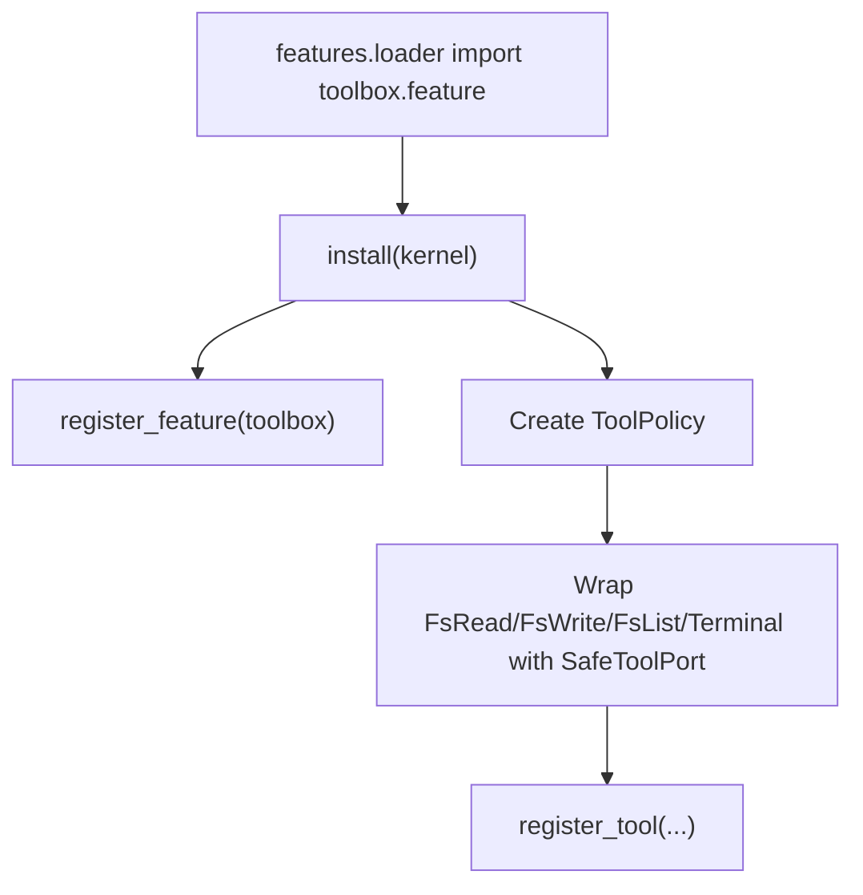

# Giải thích `toolbox/feature.py`

File `toolbox/feature.py` định nghĩa feature `toolbox`, đăng ký các tool filesystem và terminal vào kernel, đồng thời bọc từng tool bằng safety chokepoint.

Nói ngắn gọn: `feature.py` là module install của toolbox.

## `FEATURE`

```python
FEATURE = FeatureDescriptor(
    name="toolbox",
    capabilities=("fs_read", "fs_write", "fs_list", "terminal_run"),
    description="Workspace-sandboxed filesystem + terminal tools, gated by the safety chokepoint.",
)
```

Feature `toolbox` cung cấp 4 capability:

- `fs_read`
- `fs_write`
- `fs_list`
- `terminal_run`

Description nói rõ hai điểm quan trọng:

- filesystem/terminal chạy trong workspace sandbox,
- mọi tool đi qua safety chokepoint.

## Function `install`

```python
def install(kernel: AgentKernel) -> None:
    kernel.registry.register_feature(FEATURE)
    policy = ToolPolicy()
    for tool in (FsRead(), FsWrite(), FsList(), Terminal()):
        kernel.registry.register_tool(
            tool.name,
            SafeToolPort(tool.name, tool, policy),
            feature_name=FEATURE.name,
        )
```

Đây là contract với `features.loader`: module feature phải có `install(kernel)`.

### Đăng ký feature

```python
kernel.registry.register_feature(FEATURE)
```

Giúp `kernel.describe_capabilities()` thấy feature `toolbox`.

### Tạo policy dùng chung

```python
policy = ToolPolicy()
```

Mọi tool trong toolbox dùng chung một policy instance.

### Đăng ký từng tool qua `SafeToolPort`

```python
SafeToolPort(tool.name, tool, policy)
```

Tool thật không được đăng ký trực tiếp. Nó được bọc bằng `SafeToolPort`, nên mỗi lần kernel gọi tool:

```text
kernel -> registry -> SafeToolPort -> ToolPolicy -> inner tool
```

Nếu policy block, inner tool không chạy.

## Luồng install



## Quan hệ với file khác

- `config/features.yaml`: bật `toolbox`.
- `toolbox/filesystem.py`: implement `FsRead`, `FsWrite`, `FsList`.
- `toolbox/terminal.py`: implement `Terminal`.
- `safety/policy.py`: cung cấp `SafeToolPort`, `ToolPolicy`.
- `tests/test_toolbox.py`: kiểm tra fs và terminal tools qua kernel.

## Tóm tắt

`toolbox/feature.py` đăng ký feature `toolbox` vào kernel, gồm filesystem và terminal tools, tất cả đều đi qua `SafeToolPort` trước khi chạy.
