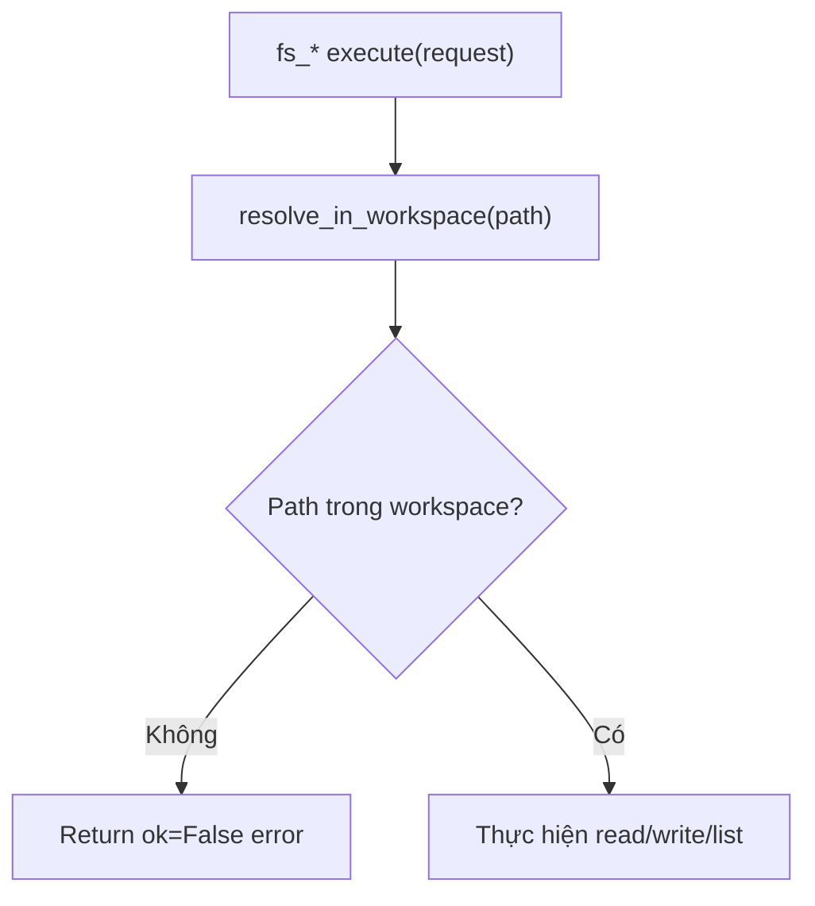

# Giải thích `toolbox/filesystem.py`

File `toolbox/filesystem.py` định nghĩa ba filesystem tool chạy trong workspace sandbox:

- `fs_read`
- `fs_write`
- `fs_list`

Nói ngắn gọn: module này cho agent đọc/ghi/list file, nhưng chỉ trong workspace.

## Điểm chung

Cả ba tool đều dùng:

```python
resolve_in_workspace(...)
```

từ `safety.sandbox`.

Nếu path escape khỏi workspace, `resolve_in_workspace` raise `SandboxError`, tool trả:

```python
{"ok": False, "error": str(exc)}
```

Kernel sẽ wrap result này thành `CapabilityResult`.

## `FsRead`

```python
class FsRead:
    name = "fs_read"
```

Tool đọc file text UTF-8.

### Luồng execute

```python
path = resolve_in_workspace(str(request.args.get("path", "")))
```

Lấy args `path`, resolve trong workspace.

```python
if not path.is_file():
    return {"ok": False, "error": f"Not a file: {path}"}
```

Nếu path không phải file, fail.

```python
return {"ok": True, "path": str(path), "content": path.read_text(encoding="utf-8")}
```

Trả nội dung file.

## `FsWrite`

```python
class FsWrite:
    name = "fs_write"
```

Tool ghi file text UTF-8.

### Luồng execute

```python
path = resolve_in_workspace(str(request.args.get("path", "")))
content = str(request.args.get("content", ""))
path.parent.mkdir(parents=True, exist_ok=True)
path.write_text(content, encoding="utf-8")
return {"ok": True, "path": str(path), "bytes": len(content)}
```

Tool:

1. resolve path trong workspace,
2. lấy content,
3. tạo thư mục cha nếu chưa có,
4. ghi file,
5. trả số ký tự/byte theo `len(content)`.

Lưu ý: `len(content)` là số ký tự Python string, không nhất thiết là byte UTF-8 thật nếu có Unicode nhiều byte.

## `FsList`

```python
class FsList:
    name = "fs_list"
```

Tool list file/folder trong workspace.

### Luồng execute

Nếu path không tồn tại:

```python
return {"ok": True, "entries": []}
```

Nếu path là file:

```python
return {"ok": True, "entries": [path.name]}
```

Nếu path là directory:

```python
return {"ok": True, "entries": sorted(p.name for p in path.iterdir())}
```

Trả danh sách tên entry, đã sort.

## Luồng sandbox



## Quan hệ với file khác

- `toolbox/feature.py`: đăng ký các tool này qua `SafeToolPort`.
- `safety/sandbox.py`: path jail.
- `tests/test_toolbox.py`: kiểm tra write/read và escape blocked.
- `tests/test_graph.py`: agent dùng `fs_write` rồi `fs_read` trong graph loop.

## Tóm tắt

`toolbox/filesystem.py` cung cấp filesystem tools sandboxed theo workspace, cho phép agent đọc, ghi và list file mà không được escape ra ngoài workspace.
